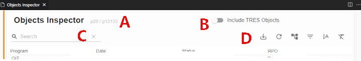
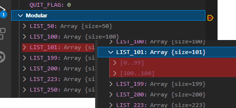

# Changelog

## Versão [2.0.2]

### Melhoria

#### Adicionado alerta na depuração utilizando SIGAMDI/SIGAADV

Caso o usuário inicie uma depuração utilizando SIGAMDI/SIGAADV, será exibido um alerta informando que na depuração é recomendada o uso direto dos módulos, por exemplo SIGAFAT.

## Versão [2.0.1]

### Melhoria

#### Comando ``BeginContent`` passa a aceitar o tipo de conteúdo

```
beginComment var myVar [as <language: javascript | JS | html | json | xml | css | typeScript | TS>]
```

Essa informação é utilizada apenas para fins visuais não sendo efetuado nenhum tipo de validação.

#### Filtro na Linha de Tempo do TDS Replay [#DTCLIENT01-2533](https://jiraproducao.totvs.com.br/browse/DTCLIENT01-2533)

Foi implementado opção de [filtro nos fontes](https://github.com/totvs/tds-vscode/wiki/TDS-Replay#filtro-de-fontes-na-linha-do-tempo) que serão apresentados na Linha de Tempo.

### Correções

#### Erro na inicialização do language server com MACOS #1173

A inicialização do `DSS` falhava (permissão) em sistemas MacOS, com erro:

```
 (7.391s) [languageServer ] dbcode_manager.cpp:544 | Binary file error. Error: [/Users/XXXXXXXXXX/gitfolder/ma3-tmp/ma3/.vscode/.advpl/_binary_functions.prw] Permission denied
```

#### DSS: Corrigido processo de renomear e remover fontes

Em determinadas circunstâncias, ao renomear ou remover fontes, os processos podiam deixar resíduos no cache, causando duplicidade de informação ou não ser finalizados, requerendo acionar a ação ``Cancelar`` no diálogo de notificação.

## Versão [2.0.0]

> Interoperabilidade entre sistemas operacionais
>
> Para garantir a interoperabilidade das áreas de trabalho entre os sistemas operacionais suportados pelo **TDS-VSCode** e seus componentes, recomenda-se que pastas e arquivos não contenham caracteres especiais (exceto hífen e sublinhado) ou acentuados e sempre em minúsculas.
>
> Leia [Convenção para nomenclatura de _File System_ em ambiente Linux](<https://tdn.totvs.com/x/h8BICw>).

### Melhorias

#### Assistente de assinatura de funções

Adicionado assistente de assinatura de funções (_SignatureHelp_).

#### Informações sobre uso e outras informações

BETA: Adicionado informações sobre o uso de funções (_CodeLens_).

#### Implementação de configuração para ignorar pastas e arquivos

Efetuado a implementação de configuração para a extensão ignorar pastas e arquivos no processo de _Navegação em fontes_ e recursos associados, através da existência do arquivo `.tdsignore`.

Detalhes da implementação em [# TDS: Developer Support Subsystem](docs/dss.md#ignore).

#### Navegação em fontes, passagem de mouse e referências

Efetuado a implementação de navegação em fontes, passagem de mouse e referências.
Detalhes da implementação em [TDS: Developer Support Subsystem](docs/dss.md).

> Os recursos aqui apresentados, podem ser influenciados devido ao _linter_ ignorar o processamento de fontes configurado em [TDS: Linter -> Ignorar pastas e arquivos](docs/linter.md#tdsignore).
> As informações sobre navegação, podem ou não ficar em [_cache_](docs/dss.md#cache).

#### Visão *Estrutura*

Apresenta alguns detalhes sobre o item de acordo com sua definição.

#### Navegação em classes quando usado ``self`` e ``_Super``

- Adicionado tratamento há herança de classe (``_Super``,  ``from``, ``inherited`` e ``of``)
- Unificado tratamento de ``::`` e ``self``

## Versão [1.3.23]

### Correções

#### Aplicação de Patch [#1145](https://github.com/totvs/tds-vscode/issues/1145)

A aplicação de patches não carrega informação de servidor e não permite aplicação.

## Versão [1.3.22]

### Correções

#### Publicação de vsix não respeita limitador de versão "^1.2.74"

O publicador de pacotes vsix não respeita o limitador de versão no formato "^1.2.74".

## Versão [1.3.21]

### Correções

#### Erro Validate Patch Fail. Please input patch file. (arquivos zip) [#1136](https://github.com/totvs/tds-vscode/issues/1136)

Corrigido de validação de patch em arquivos Zip.

#### Erro "Get organization list could not be executed" ao aplicar patch em ambiente TSS [#1139](https://github.com/totvs/tds-vscode/issues/1139)

Corrigido problema que causava erro ao aplicar patch em ambiente TSS.

#### Não permite aplicar patch com fontes mais antigos que o do RPO

Removida a trava adicionada que estava impedindo a aplicação de patches com fontes mais antigos de o do RPO.

#### Validação de patch não finaliza no Linux/MaoOS

Após validação no Linux/MacOS a ação de aplicação de patch não estava sendo liberada.

## Versão [1.3.20]

### Correções

#### Erro "Connection to server got closed. Server will restart." durante inserção de servidor

Corrigido erro de "Connection to server got closed. Server will restart." durante cadastro de novo servidor.

## Versão [1.3.19]

### Correções

#### After the last update the Monitor is not showing corretly nor terminating connections [#1123](https://github.com/totvs/tds-vscode/issues/1123)

Corrigido problema no Monitor que impedia seu correto funcionamento.

#### TDSReplay - Variavel LRET nao apresenta o valor correto

Corrigido problema na importação do TDS Replay, onde a variável local booleana LRET deveria conter o valor .T. porém apresentava "N/A (Value exists in a source that was not imported)"

#### Monitoramento de AppServer com Broker exibindo menos informações

Corrigido problema de monitoramento de AppServer com Broker que exige uma conexão diferenciada.

#### Erro ao iniciar depuração via Smartclient Web em Linux

Corrigido erro de execução de navegador em ambientes Linux.

#### Logpoint não resolve {variavel}

Corrigido erro de resolução de {variavel} em logpoints.

#### 'Command not found' ao clicar em um environment de um servidor [#1131](https://github.com/totvs/tds-vscode/issues/1131)

Corrigido erro de 'Command not found' ao clicar em um environment de um servidor. Utilizar o ícone de seleção deste environment para sua conexão.

### Melhorias

#### Adicionadas informações de condições de erro para algumas ações

Adicionadas informações de erro do AppServer durante geração de patches, remoção de arquivo do RPO, desfragmentação do RPO e revalidação do RPO.

#### Adicionados tratamento de erro durante aplicação de patch

Adicionados tratamentos para prevenir quedas do Language Server.

#### Reformulada a aplicação de patch

Otimização de processo e diminuição de mensagens exibidas. O tempo de aplicação também foi reduzido significativamente.

## Versão [1.3.18]

### Correções

#### Problema ao depurar em Linux com fonte que possuem caracteres especiais no "path" [#1078](https://github.com/totvs/tds-vscode/issues/1078)

Corrigido problema de identificação de caracteres especiais em qualquer ponto do caminho do fonte, fazendo com que a depuração fosse interrompida ou o fonte não fosse encontrado.

#### Erro ao executar Debug na versão 1.3.17 (MacOS) [#1083](https://github.com/totvs/tds-vscode/issues/1083)

Adicionado um tratamento especial para MacOS para permitir a execução do Smartclient em pastas com espaços.

### Melhorias

#### Acentuação em pastas/arquivos - not found na hora da compilação. (Linux) [#1078](https://github.com/totvs/tds-vscode/issues/1078)

Efetuada alteração para desconsiderar um tratamento de 'case' que causava o comportamento informado.

#### TDS Replay - Importação de apenas informações de fontes (Win/Mac/Linux) [#1057](https://github.com/totvs/tds-vscode/issues/1057)

Implementado nova funcionalidade no TDS Replay para importar apenas as informações dos arquivos fontes gravados.

#### Alteradas as confirmações de ações para o tipo Modal

As confirmações não estavam sendo exibidas caso a opção de "Não Incomodar" (Do Not Disturb) estivesse ativa, causando o não funcionamento de algumas funcionalidades, como por exemplo a remoção de recurso do RPO.

## Versão [1.3.17]

### Correções

#### Problema ao avaliar expressões iniciadas por "::" durante depuração [#1072](https://github.com/totvs/tds-vscode/issues/1072)

Adicionados tratamentos para substituir "::" por "self:" em situações específicas.

#### Problema ao carregar snippets dentro do VSCode [#966](https://github.com/totvs/tds-vscode/issues/966)

Ajustado processo de filtro na carga de _snippets_.

#### Erro formatação classes quando usa ponto e vírgula [#893](https://github.com/totvs/tds-vscode/issues/893)

Corrigido o tratamento de continuação de linhas (;).

#### Correção na inspeção de variáveis que não mostrava sub objetos previamente expandidos [#1017](https://github.com/totvs/tds-vscode/issues/1017)

Falha na carga de sub objetos expandidos na visão de Inspeção, após reiniciar uma depuração.

#### Correção na execução Smartclient com caminhos contendo espaços [#1059](https://github.com/totvs/tds-vscode/issues/1059)

Se houvessem espaços no caminho do executável do Smartclient estava ocorrendo erro na execução/depuração.

#### Correção no tratamento de 'warnings' de linhas maiores que 2K

O 'warning' de linhas maiores que 2K estavam impedindo a compilação destes fontes.

#### Correção no tratamento de includes na compilação de 4GL

As pastas de include não estavam sendo consideradas na compilação de fontes 4GL.

#### Correção no tratamento de retorno de login

Ajustado tratamento de retorno de login em AppServer Linux.

### Melhorias

#### Mensagens na validação de versão do AppServer

Adicionadas mensagens informativas durante a validação de versão do AppServer.

#### Adicionado tratamento para passar o parâmetro -olddpi para o Smartclient

Inclusão do parâmetro "olddpiMode" no launch.json para ativar a passagem do parâmetro -olddpi para o Smartclient.

#### Adicionado tratamento padrão de conversão de encoding de caminhos (diretórios)

Caso ainda não tenha sido configurado o encoding padrão para conversão de caminhos (diretórios), utiliza-se o cp1252.

## Versão [1.3.16]

### Melhorias

#### Verificação do tamanho de linhas em fontes

Melhorado tratamento quando há linhas no código fonte iguais ou superiores a 4Kbytes.

#### Exportação da lista de objetos (Harpia)

Foi implementando opções de exportação em arquivos nos formatos [CSV\*](https://fileinfo.com/extension/csv) (_Comma Separated values File_) e [PDF](https://fileinfo.com/extension/pdf) (_Portable Document Format File_) [#967](https://github.com/totvs/tds-vscode/issues/967).

| \* O arquivo CSV usa como separador o sinal ponto-e-virgúla entre valores e estes estão entre aspas.



|     | Descrição                                       |
|  | -- |
| D   | Barra de ferramentas (na ordem de apresentação) |
|     | Exportação CSV ou PDF                           |
|     | Agrupamemnto                                    |
|     | Filtro por coluna                               |
|     | Exportação em texto de largura fixa             |
|     | _Reset_ de configuração                         |

#### Mensagem de _TimeLine_ não encontrada para os pontos de parada existentes

Ao executar um _Run_ durante a execução do TDS Replay, caso não fosse encontrado nenhuma _TimeLine_ correspondente aos pontos de parada existentes, era feito uma parada na última _TimeLine_ da última página.
Esse comportamento foi removido e implementando uma mensagem informativa. E a _TimeLine_ de origem continuará selecionada.  [DTCLIENT01-3601](https://jiraproducao.totvs.com.br/browse/DTCLIENT01-3601)

#### Validação de _patches_ no Harpia

Ajustes na validação de pacotes de atualização (_patches_) aplicados em _AppServer_ Harpia.

### Correções

#### Correção no tratamento da chave ``openglMode`` [DTCLIENT01-3702](https://jiraproducao.totvs.com.br/browse/DTCLIENT01-3702)

Foi corrigido o tratamento da chave ``openglMode`` na definição de executores, onde a chave ``--openGL`` passa a ser informada ao _SmartClient_ somente se esta estiver ligada.

#### Erro ao tentar excluir um ambiente [#1022](https://github.com/totvs/tds-vscode/issues/1022)

Corrigido problema ao tentar excluir um ambiente

#### Unificação no tratamento do tipo _text_ (4GL) com o _char_ (AdvPL)

Foi unificado o tratamento do tipo _text_ (4GL) que estava diferente do _char_ (AdvPL).

## Versão [1.3.15]

### Melhorias

#### Revisão da documentação

Revisão geral da documentação da extensão.

#### Implementado opção de rastreamento de comunicação do VS-Code com servidor de depuração

A configuração do rastreamento pode ser efetuado pela chave `totvsLanguageServer.trace.debug` na janela de `settings`.

| Valor      | Nível                                                                         |
| - | -- |
| `off`      | Valor padrão, apresentando as mensagens habituais.                            |
| `messages` | Além das habituais, apresenta as mensagens de comunicação.                    |
| `verbose`  | Além das habituais, apresenta as mensagens de comunicação de forma detalhada. |

#### Marcar _breakpoint_ em múltiplas linhas [DTCLIENT01-346](https://jiraproducao.totvs.com.br/browse/DTCLIENT01-3435) [#995](https://github.com/totvs/tds-vscode/issues/995)

Ao iniciar a depuração, os pontos de paradas são avaliados:

- linha em branco
- linha de continuação, ajustando-a para a última linha do comando

Em caso da avaliação modificar o ponto de parada, a mesma é indicada visualmente na visão de "Pontos de Parada" e ao passar o _mouse_ sobre o ponto de parara é apresentado o motivo.

#### Verificar pontos de parada e eliminar inválidos [DTCLIENT01-3435](https://jiraproducao.totvs.com.br/browse/DTCLIENT01-3435)

Em determinadas situações, p.e. mover um fonte "por fora" do VS-Code e houver ponto de parada (_breakpoint_) já definido para este fonte, pode ocorrer erro no momento de depuração.
Foi adicionado tratamento que ao identificar um ponto de parada inválido, o mesmo será removido da lista de pontos de paradas (_Breakpoints_) e o usuário será avisado sobre a ocorrência.

#### Apresentação de listas (_array_) [DTCLIENT01-3354](https://jiraproducao.totvs.com.br/browse/DTCLIENT01-3354)

- Listas (_arrays_) com mais de 100 elementos, passam a ser agrupados em blocos de 100, facilitando a visualização e o depurador passa a carregá-los sob solicitação.
  

#### Configuração de código de página (_codePage_) por ambiente [DTCLIENT01-3410](https://jiraproducao.totvs.com.br/browse/DTCLIENT01-3410)

- No [Monitor](./docs/monitor.md#codepage), foi adicionado opção de configuração de código de página por ambiente.

### Correções

#### Gerando arquivos iniciado com "AP\_" na pasta do projeto [DTCLIENT01-3485](https://jiraproducao.totvs.com.br/browse/DTCLIENT01-3485) e [#990](https://github.com/totvs/tds-vscode/issues/990)

Em ambientes linux/mac, o _linter_ estava deixando arquivos de apoio no projeto do usuário.

#### Monitor

- Correções de retorno visual na barra status sobre as operações do monitor.

#### [4GL/Debug] Variáveis apresentam mensagem de erro de expressão [DTCLIENT01-3417](https://jiraproducao.totvs.com.br/browse/DTCLIENT01-3417)

Em determinadas situações, o depurador do _appServer_ em ambiente **Logix**, retorna como "tipo" uma _string_ vazia, podendo cancelar/travar a depuração de código Adv/PL ou 4gl. Foi adicionado paliativo na extensão que indica o tipo como desconhecido (_unknow type_), apresenta o valor e permite continuar o processo de depuração.

#### [4GL/Debug] Variáveis booleanas do ADVPL apresentam msg de erro de expressao [DTCLIENT01-3438](https://jiraproducao.totvs.com.br/browse/DTCLIENT01-3438)

Ajustado processo de avaliação de expressões e ambiente.

#### [4GL/Debug] Queda do depurador \[LOGIX-149\]

Em situações onde a pilha de execução ultrapassava 20 níveis, poderia ocorrer a queda do depurador.

#### Inspetores lado a lado, não apresenta resultado esperado em um deles [DTCLIENT01-3210](https://jiraproducao.totvs.com.br/browse/DTCLIENT01-3210)

Ajustado processo de obtenção/apresentação dos resultados.

## Versão [1.3.14]

### Melhorias

#### Adicionar tratamento de expressões 4GL [DTCLIENT01-3338](https://jiraproducao.totvs.com.br/browse/DTCLIENT01-3338)

Adicionado tratamento na pré-avaliação de expressões 4GL.

### Correções

#### Ao ocorrer uma exceção (error.log) o debugger no vscode cai com erro de sincronismo [DTCLIENT01-3344](https://jiraproducao.totvs.com.br/browse/DTCLIENT01-3344)

Ajustado a comunicação entre o _DA_ e o _appServer_ quando há exceção na aplicação 4GL/AdvPL.

#### Desfragmentação do RPO não remove histórico de aplicação de patches [#974](https://github.com/totvs/tds-vscode/issues/974)

- Retornamos ao comportamento anterior pois o AppServer armazena uma cópia do patch no RPO, que é removido apenas junto ao histórico de aplicação.

## Versão [1.3.13]

### Correções

#### Function Inspector não carrega no appserver Harpia no Mac [#940](https://github.com/totvs/tds-vscode/issues/940)

- Removido um processo interno que não funcionava adequadamente no Mac.

### Melhorias

- Identificação do tipo de servidor pelo ambiente conectado, quando servidor Harpia. [DTCLIENT01-3246](https://jiraproducao.totvs.com.br/browse/DTCLIENT01-3246)

#### Array 4GL dinamico mostra SIZE incorreto no DEBUG via VSCODE

- Correção na determinação e apresentação do tamanho de listas (_arrays_). [DTCLIENT01-3149](https://jiraproducao.totvs.com.br/browse/DTCLIENT01-3239)

#### Não é possível validar token no Linux

- Correção efetuada para validar corretamente o token. [DTCLIENT-3264](https://jiraproducao.totvs.com.br/browse/DTCLIENT01-3264)

## Versão [1.3.12]

### Correções

#### Log de repositório com problemas no appserver Harpia

- Adequação de informações retornadas pelo _appServer_. [DTCLIENT01-3239](https://jiraproducao.totvs.com.br/browse/DTCLIENT01-3239)

## Versão [1.3.11]

### Melhorias

- Implementação de [inspetor de objetos e funções para o Harpia ou superior](./docs/rpo-inspector.md#harpia). [DTCLIENT01-3147](https://jiraproducao.totvs.com.br/browse/DTCLIENT01-3147)

- Validação do arquivo de servidores (_servers.json_).

  Em caso de erros lhe será apresentado aviso na visão `Problemas`.

- Depuração: Tratamento do tipo _JSON_ em fontes _tlpp_ [#886](https://github.com/totvs/tds-vscode/issues/886)

  Durante a depuração de fontes _tlpp_ com variáveis do tipo _JSON_, estas são apresentadas de forma hierárquica nas visões `Variáveis`, `Inspeção` e outras.

### Removido

- Depuração via SIGAPAF devido a incompatibilidade entre aplicações.

### Correções

#### Não mostra tabela como resultados da compilação

- Corrigido processo de abertura da tabela de resultados. [#895](https://github.com/totvs/tds-vscode/issues/895)

#### Tela do Monitor não é exibida

- Corrigido problema na geração da extensão que fazia com que os fontes da tela do monitor não fossem adicionados ao pacote. [DTCLIENT01-3163](https://jiraproducao.totvs.com.br/browse/DTCLIENT01-3163)

#### TDS Replay: Caso o arquivo do TDS Replay gerado possua um fluxo especifico, a importação apresenta um erro e é cancelada

- Corrigido problema, onde dependendo do arquivo, a importação era interrompida no meio do processo. [DTCLIENT01-3157](https://jiraproducao.totvs.com.br/browse/DTCLIENT01-3157)

#### Depuração em MACos esta caindo

- Corrigido dependências de bibliotecas de terceiros que causavam a queda. [DTCLIENT01-3160](https://jiraproducao.totvs.com.br/browse/DTCLIENT01-3160) [#875](https://github.com/totvs/tds-vscode/issues/875)

## Versão [1.3.10]

### Correções

#### Reversão de modificações indevidas no "Inspetor de Objetos"

## Versão [1.3.9]

### Melhorias

- Implementação de depuração via SIGAPAF. [docs/debugger.md]

- Adicionado confirmação na operação de _reset_ de configuração no `Monitor`. [DTCLIENT01-2908](https://jiraproducao.totvs.com.br/browse/DTCLIENT01-2908)

- Adicionado limite de tamanho em mensagens enviadas ao usuário via `Monitor`. [DTCLIENT01-2849](https://jiraproducao.totvs.com.br/browse/DTCLIENT01-2849)

- A extensão `.RPTDESIGN`, passa a ser reconhecida como um recurso padrão na compilação.

### Correções

#### TLPP: ajustes visuais nos tipos nativos [#871](https://github.com/totvs/tds-vscode/issues/871)

- Ajustado definições nos tipos nativos.

#### Falha na autenticação de usuário

- Em determinadas situações, o usuário não era identificado corretamente.

#### 4GL: correção na identificação de _snippets_ de código de diretivas [DTCLIENT01-2904](https://jiraproducao.totvs.com.br/browse/DTCLIENT01-2904)

- Ajustado identificação de diretivas.

#### Correção na exibição de Array no TDS Replay [#853](https://github.com/totvs/tds-vscode/issues/853) [DTCLIENT-3141](https://jiraproducao.totvs.com.br/browse/DTCLIENT01-3141)

- Corrigido um problema no TDS Replay que poderia fazer com que alguns arrays não expandissem na visão de variáveis e não mostrassem o valor ao usar a visão de "Watch" e "Debug Commands"

#### Mensagens de compilação não são mais mostradas [#866](https://github.com/totvs/tds-vscode/issues/866)

- Corrigido apresentação de mensagens de compilação na visão "Problemas".

## Versão [1.3.8]

### Melhorias

- Tradução de _strings_ em geral.

### Correções

#### Erro no Linter ao comparar programas fontes [#852](https://github.com/totvs/tds-vscode/issues/852) [DTCLIENT01-3100](https://jiraproducao.totvs.com.br/browse/DTCLIENT01-3100)

Ao utilizar a opção de comparação do Controle de Versionamento em um arquivo fonte, o _Linter_ indica um erro o arquivo original. A notificação de erro na visão _Problems_ persiste mesmo após fechar a comparação.

- Adicionado tratamento no _linter_ para ignorar arquivos de comparação.

#### Erro na aplicação de patchs erp 12.1.33 [#850](https://github.com/totvs/tds-vscode/issues/850)

- Correção no processo de aplicação de pacotes devido a mudanças de comportamento no _appServer_.

## Versão [1.3.5]

### Melhorias

- Adição de nota sobre o uso de _token de RPO_ e chaves de compilação (_banner_ e documentação);
- Suporte a edição de arquivos de definições TLPP (.th);
- Adição de tema de ícones;
- Tratamento no monitor de dados em cirílico (CP1251).

### Correções

#### Aplicação de pacotes [#820](https://github.com/totvs/tds-vscode/issues/820)

- Correção no processo de aplicação de pacotes e ajustes visuais.

#### Tratamento de palavras chave em fontes .4gl [DTCLIENT01-2831](https://jiraproducao.totvs.com.br/browse/DTCLIENT01-2831)

Em determinadas estruturas de código 4GL, as palavras reserveadas ficavam parcialmente em maísculas.

#### Travamento Monitor VSCode [#817](https://github.com/totvs/tds-vscode/issues/817) [DTCLIENT01-2649](https://jiraproducao.totvs.com.br/browse/DTCLIENT01-2649)

Após acionar a funcionalidade `Stop server` ocorria travamento do mesmo.

#### Correção no uso de filtros na importação de arquivo TDSReplay [#803](https://github.com/totvs/tds-vscode/issues/803) [DTCLIENT01-2978](https://jiraproducao.totvs.com.br/browse/DTCLIENT01-2978)

Efetuada correção no tratamento de filtro `includeSource`.

#### Processamento de listas no TDS-Replay [DTCLIENT01-3056](https://jiraproducao.totvs.com.br/browse/DTCLIENT01-3056)

Ajustado tratamento de listas encadeadas (_arrays_ dentro de _arrays_).

#### AskForProgramName não funciona com debug WebApp [DTCLIENT01-3066](https://jiraproducao.totvs.com.br/browse/DTCLIENT01-3066)

Ajustado tratamento do argumento _AskForProgramName_.

#### Validar Chave de compilação resulta em tela preta [DTCLIENT01-3072](https://jiraproducao.totvs.com.br/browse/DTCLIENT01-3072)

Ajustado propriedades dos botões.

## Versão [1.3.4]

### Melhorias

- Documentação sobre a estrutura do arquivo _servers.json_.

### Correções

#### Debugger - Objeto avaliando erroneamente os parametros ([ISSUE 655](https://github.com/totvs/tds-vscode/issues/655)) ([DTCLIENT01-2500](https://jiraproducao.totvs.com.br/browse/DTCLIENT01-2500))

##### Problema

- Ao criar dois arrays da mesma classe e com nomes parecidos, o debugger nao avalia corretamente os valores, trazendo as informações de um array em outro.

##### Solução

- Correção realizada no debugAdapter o qual identificava erroneamente o nome do segundo objeto e não atualizava seu valor.

#### Botões APPLY e APPLY/CLOSE da aplicação de patchs estão editáveis #787

##### Problema

- Os botões Apply/Apply Close na tela de aplicação de patch estão aceitando editar o texto

##### Solução

- Correção feita para não permitir a edição do texto da tela

#### Insufficient privileges for APPLY_PATCH #651

##### Problema

- A definição de privilégios via as chaves da sessão \[TDS\], tratam somente endereços _IP´s_.

##### Solução

- Foi adicionado tratamento para usar nome da estação.
  Detalhes em [Sistema de Privilégios](docs/servers.md).

#### Monitor -Filtering on/off - Query não apresenta resultado. [DTCLIENT01-2861](https://jiraproducao.totvs.com.br/browse/DTCLIENT01-2861)

##### Problema

- Monitor não apresenta resultado e reseta ao efetuar agrupamento por alguns atributos numéricos.

##### Solução

- Resolvido no chamado [DTCLIENT01-2860](https://jiraproducao.totvs.com.br/browse/DTCLIENT01-2860).

#### Monitor -Grouping on/off - Query não apresenta resultado. [DTCLIENT01-2860](https://jiraproducao.totvs.com.br/browse/DTCLIENT01-2860)

##### Problema

- Monitor não apresenta resultado e reseta ao efetuar agrupamento por alguns atributos numéricos.

##### Solução

- Ajustado configurações dos tipos de campos numéricos para strings e eliminado formatação.

#### Monitor Update Speed Interval between updates (long).Opção Manual não funciona. [DTCLIENT01-2862](https://jiraproducao.totvs.com.br/browse/DTCLIENT01-2862)

##### Problema

- Diálogo de seleção de velocidade de atualização, não atualiza corretamente a chave `manual`.

##### Solução

- Ajustado a atualização do diálogo.

#### ADVPLS não esta gerando informações do pacote através da action \[patchInfo\] [DTCLIENT01-2846](https://jiraproducao.totvs.com.br/browse/DTCLIENT01-2846)

##### Problema

- Ao utilizar o comando advpls com as instruções, o script executa as funções de compilar, aplicar patch, gerar patch e desfragmentar, mas não esta gerando o relatório patchInfo.

##### Solução

- Correção no tratamento na gravação das informações de "patch" (pathinfo).

#### Verificar mensagem de erro em aplicação de patch [DTCLIENT01-2853](https://jiraproducao.totvs.com.br/browse/DTCLIENT01-2853)

##### Problema

- Mensagem de erro apresentada não codiz com o erro original que é aplicar pacote de atualização com serviço REST (HTTPV11) ou outro _job_ em execução.

##### Solução

- Ajustado tratamento de erro no processo de aplicação de pacotes de atualização de acordo com a ocorrência.

### Melhorias

- Removido opcao de filtro de 1500 _TimeLine_s para facilitar calculo de paginação

#### Processamento de fluxo em um array complexo ([ISSUE 686](https://github.com/totvs/tds-vscode/issues/686)) ([DTCLIENT01-2784](https://jiraproducao.totvs.com.br/browse/DTCLIENT01-2784))

##### Problema

- O array ANFITEM informado pelo usuario possui um fluxo de processamento bastante complexo, com uma série de referências. Em determinado momento o TDS Replay processava o valor erroneamente fazendo com que o valor mostrado estivesse incorreto.

##### Solução

- Alterado toda a lógica de processamento de variáveis para identificar corretamente esse tipo de situação e mostrar o valor correto para o usuário.

#### Identificação e processamento da lista de exclusão de fontes ([ISSUE 754](https://github.com/totvs/tds-vscode/issues/754)) ([DTCLIENT01-2819](https://jiraproducao.totvs.com.br/browse/DTCLIENT01-2819))

##### Problema

- A lista de exclusão de fontes não levava em consideração fontes que não existissem na área de trabalho. Dessa forma, a _TimeLine_ é mostrada, sendo que deveria ser filtrada.

##### Solução

- Alterado o processamento das lista de exclusão para que nem avalie o fonte caso ele não exista na pasta corrente.

#### Inicialização caso nenhum fonte seja encontrado [DTCLIENT01-2856](https://jiraproducao.totvs.com.br/browse/DTCLIENT01-2856)

##### Problema

- Ao iniciar a execução de um arquivo TDSReplay, caso não exista nenhum fonte na pasta corrente e que tenha passado pelos filtros de inclusão e exclusão, o processo fica parado com uma mensagem que ainda está iniciando, dando a impressão que está travado.

##### Solução

- Alterado o processo de inicialização para caso a condição acima ocorra, seja enviado notificação para o usuário na tela de **DEBUG CONSOLE** e também como uma notificação que pode ser vista pelo **sino** do lado inferior direito do VSCode.

##### Problema

- O array ANFITEM informado pelo usuario possui um fluxo de processamento bastante complexo, com uma série de referências. Em determinado momento o TDS Replay processava o valor erroneamente fazendo com que o valor mostrado estivesse incorreto.

##### Solução

- Alterado toda a lógica de processamento de variáveis para identificar corretamente esse tipo de situação e mostrar o valor correto para o usuário.

#### Identificação e processamento da lista de exclusão de fontes ([ISSUE 754](https://github.com/totvs/tds-vscode/issues/754)) ([DTCLIENT01-2819](https://jiraproducao.totvs.com.br/browse/DTCLIENT01-2819))

##### Problema

- A lista de exclusão de fontes não levava em consideração fontes que não existissem na área de trabalho. Dessa forma, a _TimeLine_ é mostrada, sendo que deveria ser filtrada.

##### Solução

- Alterado o processamento das lista de exclusão para que nem avalie o fonte caso ele não exista na pasta corrente.

#### Inicialização caso nenhum fonte seja encontrado [DTCLIENT01-2856](https://jiraproducao.totvs.com.br/browse/DTCLIENT01-2856)

##### Problema

- Ao iniciar a execução de um arquivo TDSReplay, caso não exista nenhum fonte na pasta corrente e que tenha passado pelos filtros de inclusão e exclusão, o processo fica parado com uma mensagem que ainda está iniciando, dando a impressão que está travado.

##### Solução

- Alterado o processo de inicialização para caso a condição acima ocorra, seja enviado notificação para o usuário na tela de **DEBUG CONSOLE** e também como uma notificação que pode ser vista pelo **sino** do lado inferior direito do VSCode.

## Versão [1.3.3]

### Correções

#### Travamento na compilação (<https://jiraproducao.totvs.com.br/browse/DTCLIENT01-2828>)

##### Problema

- Ao acionar a compilação com uma depuração em andamento, não é mais possível efetuar compilações, sendo necessário reiniciar o VS-CODE.

##### Solução

- Revisto procedimentos de bloqueio de compilação e depuração simultâneos.

#### Monitor "stop server" (<https://github.com/totvs/tds-vscode/issues/776>)

##### Problema

- Ao cancelar o diálogo o servidor é encerrado.

##### Solução

- Revisto o tratamento do retorno do diálogo.

#### Monitor "update speed" (<https://github.com/totvs/tds-vscode/issues/775>)

##### Problema

- Ao cancelar o diálogo após mudar a velocidade e abri-lo novamente, a velocidade apresentada não é original.

##### Solução

- Revisto o tratamento do retorno do diálogo.

#### Consumo de memória durante o Debug pelo DebugAdapter (<https://github.com/totvs/tds-vscode/issues/738>)

##### Problema

- Durante o Debug, o programa debugAdapter aumenta muito o consumo de memória

##### Solução

- Alguns problemas de vazamento de memória foram corrigidos

#### Consumo de memória alto pelo ADVPLS (<https://github.com/totvs/tds-vscode/issues/765>)

##### Problema

- Durante o uso do Linter, o consumo de memória do ADVPLS aumenta e só diminuia fechando o VSCode

##### Solução

- Foram detectados vazamentos de memória durante a análise dos fontes pelo Linter e corrigidos

#### Bug no Linter com arquivos CH

##### Problema

- Erro no TDS-Linter com arquivos .CH

##### Solução

- Arquivos .CH não devem ser tratados pelo TDS-Linter

#### Bug na falha de conexão com um servidor (<https://github.com/totvs/tds-vscode/issues/678>)

##### Problema

- Ao tentar se conectar a um servidor inacessível, ocorria erro mas o servidor passava para o estado de conectado (ícone verde).

##### Solução

- Revisto o tratamento do retorno de falha da conexão com o servidor.

#### Erro na indentação automática (<https://github.com/totvs/tds-vscode/issues/701>)

##### Problema

Ao indentar o fonte onde há dentro de uma estrutura For, uma variável que comece com as letras `n e x t`, ocorre erro de indentação.

##### Solução

- Revisto processo e regras de expressão.

#### Ao debugar no Linux o smartclient não fecha automaticamente (<https://github.com/totvs/tds-vscode/issues/685>)

##### Problema

Ao solicitar a finalização da depuração, no Linux, o smartclient não fecha automaticamente.

##### Solução

- Implementado procedimento de encerramento do SmartClient.

#### Funcionalidades para o Logix perdidas (<https://github.com/totvs/tds-vscode/issues/766>)

##### Problema

Após atualização as tags Logix deixaram de ficar em caixa alta.

##### Solução

- Revisto o processo de formatação de fontes 4GL.
- Necessário o usuário [ativar a formatação](docs/formatter/format_config.md).

### Melhorias

- Revalidate RPO: implementado comando para revalidar o RPO em servidores versão 20.3.0.0 ou superior.
- Implementando controle de compilação em andamento, evitando o inicio de depuração/execução durante o processo.

## Versão [1.3.2]

### Correções

#### Erro ao tentar aplicar patch (<https://github.com/totvs/tds-vscode/issues/737>)

##### Problema

- Erro ao tentar aplicar patch no MacOS. A validação da Aplicação de Patch informa que existem caracteres em letras maíusculas e impede a aplicação.

##### Solução

- Alterada a validação para não impedir a aplicação. Gera apenas um Warning, pois caso ocorra um erro pode-se tentar corrigir renomeando os caminhos.

### Melhorias

- Alterações internas no processo de carga de parametrização inicial do LS.
- Implementações de tratamento de encoding dos caminhos do sistema de arquivos para cp1252 (padrão) ou cp1252 (russo).

## Versão [1.3.1]

### Correções

#### DEBUG VSCode Linux e AppServer Windows (<https://github.com/totvs/tds-vscode/issues/726>)

##### Problema

- Falha na conexão com o AppServer durante a depuração em ambientes Linux e Mac.

##### Solução

- Ajustado um processo interno corrigir a falha da conexão.

#### Erro Linter (is empty or corrupted..) (<https://github.com/totvs/tds-vscode/issues/729>)

##### Problema

- O Linter acusava erro na primeira linha indicando a mensagem "is empty or corrupted..".

##### Solução

- Isso estava ocorrendo quando existia um espaço em qualquer lugar do caminho do fonte analisado. Foi corrigido um processo interno para tratar o espaço no caminho.

## Versão [1.3.0]

### Melhoria

- Implementação do Linter. Veja mais detalhes em [TDS: Linter](docs/linter.md).

### Correções

#### Reversão da atualização da Aplicação de Patches

#### Inclusão de validação complementar de marcas de FW do Patch a ser aplicado

## Versão [1.2.5]

### Correções

#### Erro ao executar SIGAADV via DebugErro ao executar SIGAADV via Debug (<https://github.com/totvs/tds-vscode/issues/714>)

##### Problema

- Ocorria erro "Failed to load APPMAP" ao iniciar uma depuração.

##### Solução

- Corrigido um processo interno de carga de informações do RPO.

## Versão [1.2.4]

### Correções

#### Problema na aplicação de patch em Windows Server (<https://github.com/totvs/tds-vscode/issues/695>)

##### Problema

- Ocorria erro de arquivo não encontrado na aplicação/validação de patches.

##### Solução

- Corrigido o formato de envio do caminho do patch para URI.

## Versão [1.2.3]

### Melhoria

#### Geração de pacote de atualização (_patch_) por diferença

#### Novo Recurso

- Liberado recurso para geração de pacotes (_patch_) por diferença. Este pode ser acessado via menu de contexto de um servidor na visão `Servidores` ou via paleta de comando `TOTVS: Generation patch (from difference).

#### [TOKEN RPO]

- TokenRPO: implementado comando para remoção de token aplicado, via opção na barra de status ou via _api_ `clearRPOToken`.

### Correções

#### Depuração/execução: não salva o atributo 'lastProgramExecuted'

##### Problema

- Ao depurar/executar, o último programa executado não é apresentado.

##### Solução

- Ajustado salva do atributo 'lastProgramExecuted' na configuração do executor (.vscode\launch.json).

##### Problema na importação de arquivo do TDS Replay (<https://github.com/totvs/tds-vscode/issues/672>)

##### Problema

- Arquivo do TDS Replay enviado pelo usuario parava a importação por volta de 100MB

##### Solução

- Corrigido um processo interno que poderia causar uma falha de importação, interrompendo o processo.

#### [BETA] Adição do suporte a nova chave (Token compilação) para o [RPO Seguro](docs/rpo.md)

#### Implementar a funcionalidade de aplicação de Templates. [Issue 622](https://github.com/totvs/tds-vscode/issues/622)

### Melhorias

- Troca das imagens na documentação do monitor por outras com melhor resolução.
- Adicionada a funcionalidade para aplicação de Templates (.tpl).
- [BETA] Esta funcionalidade encontra-se em testes Beta. Caso encontre algum problema na aplicação de um Template abra uma Issue com o Template em questão informando como aplicar e como validar o Template para que possamos rever o processo.

#### Revisão de processos de edição 4GL

##### Problema

- A formatação de palavras-chaves ocorre ao acionar `ENTER`.

##### Solução

- Processo de formatação revisado, passando a tratar palavras-chaves durante a digitação. Detalhes em [Formatação de código fonte](docs/formatter/format_config.md)

#### Debug do mesmo objetos de instancias diferentes avaliando erroneamente valor de atributos (<https://github.com/totvs/tds-vscode/issues/655>)

##### Problema

- Ao criar duas instancias de um mesmo objeto e pedir para avaliar o conteudo deles, uma das instancias trazia o valor da outra

##### Solução

- Corrigido processo de cache de objetos para considerar o nome completo do mesmo.

## Versão [1.2.2]

### Correções

#### [4GL][tdsvscode 1.2.1] Variáveis Array de Record não tem valores visualizados no DEBUG [Issue 590](https://github.com/totvs/tds-vscode/issues/590)

##### Problema

- Ao depurar código 4GL que tenha variáveis modulares do tipo ARRAY OF RECORD, os valores dos itens da lista não são apresentadas.

##### Solução

- Na análise da ocorrrência, verificamos que o tipo de servidor, em `servers.json`, não estava correto.
- Foi adicionado atributo tipo de servidor (`type`) no registro de novos servidores.

Para servidores registrados antes desta versão, favor:

- abrir o arquivo `servers.json` em modo texto;
- ajustar o atributo `savedTokens` para uma lista vazia;
- localize a definição do servidor LOGIX e ajuste o atributo `type` para `totvs_server_logix`.

Detalhes em
<https://github.com/totvs/tds-vscode/issues/590#issuecomment-742527102>.

#### Configurar uma pasta inicial padrão para geração de patches. [Issue 398](https://github.com/totvs/tds-vscode/issues/398)

### Melhoria

- Adicionada a salva da última pasta utilizada na geração de patches que será sugerida na próxima geração.

#### Atualização de versão do TypeScript para 4.1

##### Problema

- Devido a quebra de compatibilidade com versões anteriores, ocorrem erros de compilação.
  Detalhes em [Breaking changes](https://devblogs.microsoft.com/typescript/announcing-typescript-4-1/#breaking-changes)

##### Solução

- Código compatibilizado com o TS 4.1.

#### Implementação do processo de validação de pacotes de atualização (_patch_)

##### Problema

- Os pacotes de atualização eram validados parcialmente.

##### Solução

- Reformulação do processo de validação/aplicação de pacotes.
- Interface com usuário refeita, para atender o novo processo.

#### Informar parâmetros para debugar ponto de Entrada. [Issue 589](https://github.com/totvs/tds-vscode/issues/589)

##### Problema

- Não estava sendo possível informar parâmetros de entrada para o SmartClient.

##### Solução

- Foi revisto o processo de obtenção dos parâmetros de entrada, na execução e depuração, assim como foi revisto o configurador de Launchers para cadastrar parâmetros nos launchers.

## Versão [1.2.1]

### Correções

#### Não exibe conteúdo de array no Watch. [Issue 549](https://github.com/totvs/tds-vscode/issues/549)

##### Problema

- O conteúdo de arrays não estavam sendo exibidos/atualizados nas variáveis e watch, durante a depuração.

##### Solução

- Foi realizado uma correção no DA para considerar os arrays e 'parent' de objetos.

#### VSCode Debug error: User not authenticated. Please connect/reconnect to a server. [Issue 423](https://github.com/totvs/tds-vscode/issues/423)

##### Problema

- Ocorria erro indicando que o usuário não estava conectado ao iniciar a depuração. Isso ocorria apenas com usuários cujo nome continham acentuações.

##### Solução

- Foi revista e corrigida a carga das chaves necessárias para ler o token de conexão do LS pelo DA.

#### Confirmar exclusão de servidor [Issue 578](https://github.com/totvs/tds-vscode/issues/578)

### Melhoria

- Adicionada uma confirmção para ação de exclusão de servidores.

#### Aplicação de Patch (Apply Patch) não funciona [Issue 573](https://github.com/totvs/tds-vscode/issues/573)

##### Problema

- O botão 'Apply Patch' não está funcionando quando não há uma chave de compilação válida aplicada.

##### Solução

- Adicionada validação de existência da chave antes da operação de 'Apply Patch'.

#### Erro intermitente na conexão com o appserver advpl [Issue 518](https://github.com/totvs/tds-vscode/issues/518)

##### Problema

- Ao tentar compilar um fonte enquanto existe uma depuração ativa, ocorre um erro fatal no LS.

##### Solução

- Adicionamos proteções nas ações que necessitam de acesso exclusivo ao RPO que impedem sua execução se a depuração estiver ativa.

#### Conexão com Monitor dando erro de Privilégio [Issue 571](https://github.com/totvs/tds-vscode/issues/571)

##### Problema

- Ocorre erro na verificação de privilégios para obter os usuários no Monitor.

##### Solução

- A validação foi temporariamente desativada para questões do Monitor.

#### Aborting end build (rollback changes) [Issue 564](https://github.com/totvs/tds-vscode/issues/564)

##### Problema

- Ao compilar workspace ou pasta com vários arquivos e ocorrer erro em um dos arquivos compilados, todos os arquivos não são compilados (rollback).

##### Solução

- Adicionada a opção "Comitar a compilação com erros/alertas" que permite habilitar o 'commit' mesmo com erros/alertas em arquivos que estão sendo compilados.

## Versão [1.2.0]

### Genéricas

- Documentação e ajustes no [Sistema de Privilégios](docs/servers.md)
- Implementação de opção para visualização do log do repositório

#### Implementação da API generatePPO

- Foi implementada a API generatePPO que gera o conteúdo do PPO do arquivo em edição. Maiores detalhes em [API exportadas](https://github.com/totvs/tds-vscode/blob/dev/docs/exported-api.md)

#### Chave de compilação Inválida [Issue 563](https://github.com/totvs/tds-vscode/issues/563)

##### Problema

- Ao aplicar uma chave de compilação ocorre erro indicando que a chave é inválida.

##### Solução

- Foi aplicada uma correção interna nas validações da chave de compilação.

#### Implementação chamado #269

- Opção de manter as configurações de servidores na área de trabalho e [troca rápida](docs/servers.md)

#### Correção chamado #553

- Erro de compilação [FATAL] não é exibido na aba PROBLEMS e nem no LOG do AppServer.

## Versão [1.1.1]

### Correções

#### Correção chamado #549

- Não exibe conteúdo de array e objetos no Watch

#### Correção chamado #444

- DEBUG 4GL não aceita expressões na view DEBUG CONSOLE e derruba AppServer (linux) em uma atribuição inválida

## Versão [1.1.0]

### Genéricas

- Atualização de dependências de terceiros
- Higienização de código
- Atualização de documentação (reorganização)

### Correções

#### Correção chamado #371

- Corrigido a solicitação de autenticação ao trocar de servidor/ambiente, mesmo com senha salva.

#### Correção chamados #520 e #526

- Corrigido a seleção de programa/função a ser executada (executor).

#### Correção chamados #531

- Corrigido apresentação da estrutura de fontes 4GL na visão `Outline`.

#### Correção na compilação 4GL quando há comando "globals \<arquivo\>"

- Resolução do chamado interno [DTCLIENT01-2015](https://jiraproducao.totvs.com.br/browse/DTCLIENT01-2015). Requer atualização do _appServer_.

#### Monitoramento de servidores TOTVS (BETA)

- Salva automática de configurações efetuadas no painel de Monitoramento
- Atualização da lista de usuários após a desconexão

#### Revisão de processos de edição 4GL

- Processo de formatação revisado. Detalhes em [Formatação de código fonte](docs/formatter/format_config.md)

## Versão 1.0.6

### Melhorias

#### Monitoramento de servidores TOTVS (BETA)

- Monitoramento de conexões do servidor corrente
- Envio de mensagens para um ou mais usuários
- Bloqueio de novas conexões
- Desconexão de um ou mais usuários ou de _jobs_

#### Revisão do processo de tradução

- Processo de tradução foi revisto. Consulte [localização](LOCALIZATION.pt-br.MD) para detalhes.

### Correções

#### PRTOPDEF File not found [Issue 440](https://github.com/totvs/tds-vscode/issues/440)

##### Problema

- Durante uma compilação a mensagem "C2090 File not found PRTOPDEF.CH" é apresentada como erro de compilação.

##### Solução

- Um filtro de extensão de arquivos estava considerando apenas a extensão em letras minúsculas. Se a extensão do arquivo for .PRW ela não estava sendo considerada como AdvPL e não adicionava os includes para compilar.

#### Extensão trava ao compilar vários fontes [Issue 437](https://github.com/totvs/tds-vscode/issues/437)

##### Problema

- Durante a compilação de múltiplos arquivos (compilação de pasta/workspace) o vscode trava e pode exibir a mensagem "The window is no longer responding".

##### Solução

- O problema está na exibição de muitas notificações pelo vscode. Por enquanto desabilitamos as notificações alterando o padrão para "none".

#### Erro ao adicionar Servidor (Cannot read property 'id' of undefined) [Issue 434](https://github.com/totvs/tds-vscode/issues/434)

##### Problema

- Ocorre erro na exibição da visão de Servidores e adição de novos servidores.

##### Solução

- Corrigido processo interno na gravação da informação do último servidor conectado.

## Versão 1.0.5

### Melhorias

### Melhorias na visão "Servidores"

- Adicionado os comandos abaixo, direto no nó do item:
    - Servidor: Conexão
    - Ambiente: Remoção
- Menu de contexto melhorado, apresentando opções conforme o estado do servidor

#### [4GL] Liberação do editor para 4GL (BETA)

#### Recursos liberados

- Sintaxe destacada conforme tipo (definição, palavra reservada, ...);
- Árvore de estrutura (_outline_), a ser detalhada em liberações futuras.

#### Ajustes

- Processo de compilação e outros de apoio

#### [4GL] Liberação do depurador para 4GL (BETA)

#### Recursos liberados

- Suporte a ponto de parada;
- Avaliação de expressões;
- Árvore de variaveis por escopo;
- Suporte a tipos específicos do 4GL (record, image e outras);

##### Problemas conhecidos (SOMENTE em servidores Logix)

Ao utilizar **TOTVS Server**, de versão igual ou anterior a 19.3.0.0 de 01/06/20, detectamos algumas inconsistências durante o processo de depuração:

- Variáveis do tipo _text_, ao terem seus valores modificados por uma atribuição, pode ocasionar queda no processo;
- Variáveis com valor _NIL_ (nulo ou indefinido), podem apresentar resultados em formato diferente quando avaliados no _watch_, do apresentado no bloco do escopo;

#### [AdvPL] Árvore de estrutura (_outline_)

- Árvore de estrutura (_outline_), a ser detalhada em liberações futuras.

#### Nomenclatura e ortografia

- Padronização da nomenclatura de _AppSever_ para _TOTVS Server_;
- Padronização da identificação _AdvPL_ para _AdvPL/4GL_, quando aplicada as duas linguagens;
- Opção do console _Advpl_, na visão _Output_, alterada para _TOTVS LS_;
- Na árvore da visão _settings_, identificação da extensão passou a ser _TOTVS_;
- Correções ortográficas;

## Versão 1.0.4

### Correções

#### Conexão com _TOTVS Server_ com erro - Smartclient 19.3.0.5 (com SSL desligado) [Issue 390](https://github.com/totvs/tds-vscode/issues/390)

##### Problema

- Após da actualizacao do binário do smartclient 19.3.0.5 quando tento lancar um debug com o TDS-VSCode, tenho a janela com siguiente erro: "ERR0027: TOTVS | SmartClient conectou com TOTVS | Application Server mas houve erro no início de validação de conexão."

##### Solução

- Ajustado a geração da configuração para depuração.

#### Ajustado geração de patch com characteres maiusculos no MAC [Issue 386](https://github.com/totvs/tds-vscode/issues/386)

##### Problema

- Após atualização do language server, o MAC, erroneamente, passou a recusar aplicação de patch caso existisse character maiusculo no caminho do arquivo. Esse processo deve ser apenas para Linux

##### Solução

- Corrigido configuração no Language Server para que o processo de validação ocorra apenas no Linux

## Versão 1.0.3

### Correções

#### Problema ao criar launchers a partir das configurações do Smartclient na inicialização [Issue 377](https://github.com/totvs/tds-vscode/issues/377)

##### Problema

- Selecione um smartclient na tela de boas vindas e salve. Os launchers não estão sendo gerados corretamente.

##### Solução

- A geração inicial do arquivo launch.json estava incompleto e foi corrigida.

#### Senha não fica salva [Issue 371](https://github.com/totvs/tds-vscode/issues/371)

##### Problema

- Ao trocar de ambiente pela seleção de servidor/ambiente na barra inferior, mesmo com o token salvo previamente, a extensão está solicitando o usuário e senha do ambiente novamente.

##### Solução/Melhoria

- A seleção de servidor/ambiente estava com a ação de "Conexão" e foi alterada para "Reconexão" para agilizar a conexão pela barra inferior.

##### Problema ao tentar gerar cliente WSDL [Issue 369](https://github.com/totvs/tds-vscode/issues/369)

##### Problema

- Problema ao tentar gerar cliente WSDL sem ter uma chave de compilação aplicada. Ocorre o erro "Authorization token was not informed.".

##### Solução

- Foi realizada correção para remover esta validação pois a chave não é obrigatória nestes casos.

#### Erro ao adicionar servidor [Issue 367](https://github.com/totvs/tds-vscode/issues/367)

##### Problema

- Ao adicionar servidor está sendo apresentada a mensagem: "Cannot read property 'length' of undefined".

##### Solução

- O processo de inicialização permitia a criação do servers.json com apenas a seção "includes". Adicionadas validações para que o arquivo mínimo seja criado ao instalar a extensão.

#### Possibilidade de exportar arquivo com as informações do conteúdo do patch [Issue 301](https://github.com/totvs/tds-vscode/issues/301)

### Melhoria

- Adicionada a funcionalidade para exportar um arquivo com as informações do conteúdo do patch em 'Patch Infos'.

## Versão 1.0.2

### Correções

#### Exibir apenas os arquivos com Erros na tabela de resultados da compilação quando ocorrer problemas nas compilações [Issue 347](https://github.com/totvs/tds-vscode/issues/347)

##### Problema

- Quando ocorrem erros (Error/Fatal) durante a compilação o processo é abortado e ocorre o "rollback". Porém a tabela com o resultado da compilação exibe os fontes sem erros como se estivessem compilados no RPO causando confusão uma vez que eles não estarão no RPO.

##### Solução/Melhoria

- Filtrar a tabela de resultados da compilação para exibir apenas os arquivos com erros quando o processo for abortado.

#### Configuração "totvsLanguageServer.extensions.folder.patch" não está sendo respeitada [Issue 297](https://github.com/totvs/tds-vscode/issues/297)

##### Problema

- A compilação não respeita o filtro de extensões definidas em "totvsLanguageServer.extensions.folder.patch".

##### Solução/Melhoria

- O problema era que esta configuração foi criada apenas para a compilação durante a geração de patches. A configuração foi alterada para "totvsLanguageServer.folder.extensionsAllowed" e será utilizada na compilação, seja apenas compilação, seja na geração de patches. Além disso foi adicionada a opção de desabilitar o filtro nos Setting em "Folder: Enable Extensions Filter".

#### Protheus ao compilar Files/Folder [Issue 329](https://github.com/totvs/tds-vscode/issues/329)

##### Problema

- Erro ao compilar pasta.

##### Solução

- O problema era com apenas um arquivo cujo retorno de erro do **TOTVS Server** estava fora do padrão. Melhorado o tratamento para capturar este erro fora do padrão e exibir ao usuário.

##### Problema na compilação com binário 7.00.191205P [Issue 292](https://github.com/totvs/tds-vscode/issues/292)

##### Problema

- Ao compilar pastas/workspaces com muitos arquivos o TDS VS Code travava e/ou caia.

##### Solução

- Limitada a exibição de notificações caso o número de arquivos ultrapasse um certo valor. Exibindo apenas as informações consolidadas após o término da compilação.

#### Separar a ação de conectar e reconectar em um servidor [Issue 344](https://github.com/totvs/tds-vscode/issues/344)

### Melhoria

- Separadas as ações de conectar e reconectar. O connect se comporta como se fosse uma nova conexão independentemente de existir um token de reconexão. E o reconnect utiliza o token de reconexão se existir ou se comporta como o connect se ainda não existir um token de reconexão.

#### Erro ao compilar fontes em aberto (.app junto) [Issue 334](https://github.com/totvs/tds-vscode/issues/334)

##### Problema

- Ao compilar arquivos em editores abertos o processo para ao encontrar um arquivo que não pode ser aberto sem a intervenção do usuário, como por exemplo um pdf.

##### Solução

- Ao encontrar um arquivo que não pode ser aberto ele passa para o próximo editor aberto.

## Versão 1.0.1

### Correções

#### Seleção de diretório seleciona o primeiro arquivo do diretório [Issue 317](https://github.com/totvs/tds-vscode/issues/317)

### Melhoria

- Ao selecionar um diretório está selecionando um arquivo deste diretório. Este problema começou após uma atualização do VS Code que mudou o comportamento do componente de seleção de diretório.

#### Implementar a verificação de integridade do RPO [Issue 288](https://github.com/totvs/tds-vscode/issues/288)

### Melhoria

- Implementada a verificação de integridade do RPO no menu de contexto do servidor conectado, similar a opção de desfragmentação do RPO.

#### Exibir o console (Output) durante a compilação [Pull Request 271](https://github.com/totvs/tds-vscode/pull/271)

### Melhoria

- Adicionada opção nas preferência para exibir o console (Output) ao acionar uma compilação.

#### Compile/Recompile open Editors [Issue 276](https://github.com/totvs/tds-vscode/issues/276)

##### Problema

- A opção de compilar/recompilar os editores abertos parou de funcionar após atualização Windows/VS Code.

##### Solução

- Ajustada a forma de comparação entre editores que foi alterada com a atualização.

#### Erro de compilação [Issue 270](https://github.com/totvs/tds-vscode/issues/270)

##### Problema

- Se a variável utilizada na instrução `For` não estiver declarada como `Local` o _TOTVS Server_ informa um 'warning', mas como a mensagem estava fora do padrão estabelecido, a mensagem se tornava um 'error'.

##### Solução

- Melhorado o tratamento das mensagens de 'error/warning' para exibir corretamente esta mensagem.

#### Opção "Select" no menu contextual do conexão ambiente não esta funcionando [Issue 253](https://github.com/totvs/tds-vscode/issues/253)

##### Problema

- Ao clicar em `Select` no menu de contexto de um 'environment' não acontece nada.

##### Solução

- Corrigida a implementação do `Select` no menu de contexto dos 'environments'.

#### Não consigo compilar fontes Vs Code [Issue 239](https://github.com/totvs/tds-vscode/issues/239)

##### Problema

- Alguns erro do pré compilador não eram exibidos corretamente na visão `Problems`.

##### Solução

- Corrigido o tratamento de mensagens de erro do pré compilador que indicavam a linha 0 (que não existe).

## Versão 0.3.23

### Correções

#### Connection terminated by administrator [Issue 189](https://github.com/totvs/tds-vscode/issues/189)

##### Problema

- Depuração derruba o servidor exibindo a mensagem "Connection terminated by administrator".

##### Solução

- Corrigida ação interna da mensagem idle da depuração.

## Versão 0.3.22

### Correções

#### Ao formatar o documento a identação fica errada quando existe #ifdef [Issue 230](https://github.com/totvs/tds-vscode/issues/230)

##### Problema

- Ao formatar o documento a identação fica errada quando existe #ifdef.

##### Solução

- Corrigida a regra para identação do #endif.

## Versão 0.3.21

### Correções

#### Extensão permite adicionar o mesmo server várias vezes [Issue 58](https://github.com/totvs/tds-vscode/issues/58)

##### Problema

- Extensão permite adicionar o mesmo server várias vezes.

##### Solução

- Correção do problema no momento da inclusão ou renomeação da conexão.

#### Configuração Debug WebApp [Issue 195](https://github.com/totvs/tds-vscode/issues/195)

##### Problema

- Falha no inicio da depuração via WebApp.

#### Correção

- Corrigida situação no momento do inicio da depuração.

#### Corrigida indentação de código BeginSQL e EndSQL [Issue 214](https://github.com/totvs/tds-vscode/issues/214)

##### Problema

- Indentação de código BeginSQL e EndSQL na formatação por trecho incorreta.

##### Solução

- Correção no processo de formatação entre BeginSQL e EndSQL.

#### Focar na janela de "problemas" quando ocorrer "erro de compilação" [Issue 172](https://github.com/totvs/tds-vscode/issues/172)

##### Problema

- Focar na janela de "problemas" quando ocorrer "erro de compilação".

##### Solução

- Adicionada verificação se houve problema na compilação e muda o foco para aba de "Problemas".

## Versão 0.3.20

### Correções

#### Corrigido parada de breakpoint mesmo após ter sido removido [Issue 121](https://github.com/totvs/tds-vscode/issues/121)

##### Problema

- Mesmo após remover um breakpoint, o servidor ainda mandava uma informação de parada de depuração.

##### Solução

- Correção interna no processo do debug adapter.

#### Corrigido problema de demora de sincronização de variáveis durante a depuração [Issue 142](https://github.com/totvs/tds-vscode/issues/142)

##### Problema

- Ao expandir um grupo de variaveis ocorre uma demora excesiva para que elas sejam apresentadas.

##### Solução

- Alterado o debug Adapter para realizar uma busca mais eficiente dos fontes quando ocorrer uma parada.

#### Corrigido identação automática ao digitar a palavra "do" [Issue 152](https://github.com/totvs/tds-vscode/issues/152)

##### Problema

- Ao escrever algo que contenha a palavra "do", o código da linha com esta é indentado, realizando um recuo.

##### Solução

- Corrigido processo de identação em relação à palavra "do".

#### Corrigido erro de identação em Embedded Sql [Issue 156](https://github.com/totvs/tds-vscode/issues/156)

##### Problema

- Quando existe um código de embedded Sql com o operador UNION ALL a formatação não funciona corretamente.

##### Solução

- Corrigido processo de identação para Embedded Sql.

#### Corrigido erro de identação em WsRestful e End WsRestful [Issue 164](https://github.com/totvs/tds-vscode/issues/164)

##### Problema

- A identação dos comandos WsRestful, WsData, WsMethod e End WsRestful não são tratadas corretamente.

##### Solução

- Corrigido processo de identação para de WsRestful, WsData, WsMethod e End WsRestful.

#### Corrigido erro de identação em BeginSQL e EndSQL [Issue 188](https://github.com/totvs/tds-vscode/issues/188)

##### Problema

- A identação em comandos BeginSQL e EndSQL não funcionam corretamente.

##### Solução

- Corrigido processo de identação dos comandos BeginSQL e EndSQL.

#### Corrigido o problema de conexão [Issue 207](https://github.com/totvs/tds-vscode/issues/207)

##### Problema

- Ao cadastrar um novo servidor e tentar conectar ocorre falha na conexão.

##### Solução

- Corrigido o cadastro do servidor referente ao valor do novo parâmetro 'secure'.

## Versão 0.3.18

### Correções

#### Corrigido travamento do Debug (stacktrace e evalute) [Issue 193](https://github.com/totvs/tds-vscode/issues/193)

##### Problema

- Ao depurar fontes onde trafegavam informações, no stacktrace ou evaluate, com acentuação ocorria um problema no encoding e desconectava o Debug.

##### Solução

- Corrigido o tratamento de encoding.

## Versão 0.3.17

### Correções

#### Corrigido travamento na carga do Smartclient durante o Debug [Issue 186](https://github.com/totvs/tds-vscode/issues/186)

##### Problema

- Ao iniciar a depuração o smartclient inicia a carga mas fica travado.

##### Solução

- Corrigida a inicialização do smartclient.

## Versão 0.3.16

### Correções

#### Corrigido travamento no Debug (Avaliação de Objetos) [Issue 170](https://github.com/totvs/tds-vscode/issues/170)

##### Problema

- Ao depurar objetos ocorria um erro que travava o debug.

##### Solução

- Corrigida a avaliação de objetos no DebugAdapter.

#### Corrigido a salva do último programa executado [Issue 89](https://github.com/totvs/tds-vscode/issues/89)

##### Problema

- Ao digitar um nome de programa a ser executado pela depuração, este não era salvo para exibição na próxima execução.

##### Solução

- Corrigida a salva do nome do último programa executado.

## Versão 0.3.15

### Correções

#### Adicionada proteção durante debug de tabelas [Issue 165](https://github.com/totvs/tds-vscode/issues/165)

##### Problema

- Ao depurar tabelas ocorria um erro que derrubava o DebugAdapter.

##### Solução

- Adicionada uma proteção para tratar esse erro no **TOTVS Server** que derrubava o DebugAdapter.

## Versao 0.3.14

### Correções

#### Inclusão de PullRequest [PullRequest 155](https://github.com/totvs/tds-vscode/pull/155)

#### PullRequest

- Inclusão de palavras reservadas.

#### Corrigido problema ao abrir a tela de "Compile Key"

##### Problema

- Ao abrir a tela de "Compile Key" sem que antes algum processo tenha iniciado o Language Server, esse último era iniciado após a abertura da tela ocasionando um erro para definir o Id da máquina.

##### Solução

- Alterado o processo de abertura da tela de "Compile Key" para que se caso nao exista um "LS no ar", aguardar a inicialização do mesmo para continuar com a abertura da página.

#### Corrigido problema que fazia com que breakpoints removidos cotinuassem a realizar paradas na depuração [Issue 121](https://github.com/totvs/tds-vscode/issues/121)

##### Problema

- Durante a depuração, em um loop por exemplo, caso um breakpoint fosse removido e usuario pedisse um "Run", esse breakpoint continuava sendo considerado e a parada era realizada.

##### Solução

- Realizado correção no processo de sincronismo de breakpoints pelo debug adapter.

## Versão 0.3.13

### Correções

#### Implementado notificação de "Exceptions" informadas pelo servidor na visão "Debug Console" [Issue 99](https://github.com/totvs/tds-vscode/issues/99#)

##### Problema

- Quando é lançado uma exceção pelo servidor o plugin não mostra no console.

##### Solução

- Alterado o Servidor DAP para receber mensagens de Exception do servidor e enviar uma mensagem de log para o Client.

#### Removido a opção para inicalizar o plugin do TDS VsCode simplemsmente ao lançar uma depuração qualquer [Issue 124](https://github.com/totvs/tds-vscode/issues/124)

##### Problema

- O Plugin do TDS VsCode era ativado sempre que uma depuração era iniciada, mesmo que fosse de outra linguagem.

##### Solução

- Removido o parametro "onDebug" dos eventos que ativam a extensão.

#### Alterado mensagem de falha ao fazer o "StartBuild" para incluir sugestão de que o servidor pode estar off-line [Issue 135](https://github.com/totvs/tds-vscode/issues/135)

##### Problema

- Caso o usuario peça uma compilação e por algum motivo o servidor não está mais on-line, a mensagem de erro apresentada não era clara sobre essa situação.

##### Solução

- Mensagem de erro alterada incluindo informação para o usuario que a falha pode ter ocorrido pois o servidor está off-line.

#### Correção na identificação de declaração de classe pelo Syntax Highlight [Issue 116](https://github.com/totvs/tds-vscode/issues/116)

##### Problema

- Em uma classe, caso seja removido os espaços, ou tabs, no inicio da linha onde estão as declarações de variaveis e métodos, corrompia toda a pintura do fonte.

##### Solução

- Correão na expressão regular de identificação de variáveis e métodos na declaração de classes.

## Versão 0.3.12

### Correções

#### Correção emergencial de problema no pré compilador [Issue 111](https://github.com/totvs/tds-vscode/issues/111)

##### Problema

- Ao compilar fontes que possuam a instrução %NotDel% ocorre problema no pre compilador.

#### Solulção

- Correção interna no pré compilador.

## Versão 0.3.11

### Correções

#### Gerar saída para console [Issue 60](https://github.com/totvs/tds-vscode/issues/60)

### Melhoria

- Adicionar uma forma de gerar uma saída no console durante a depuração sem precisar compilar.

##### Solução

- Implementado a funcionalidade de "logpoint" do VsCode no Language Server.

#### Demora na execução de debug [Issue 95](https://github.com/totvs/tds-vscode/issues/95)

##### Problema

- A depuração apresenta problemas de performance e na abertura da aba de variaveis e tabelas.

##### Solução

- Feito uma série de pequenas correções no servidor DAP.

#### Erro ao aplicar patch [Issue 96](https://github.com/totvs/tds-vscode/issues/96)

##### Problema

- Erro "Patch URI list not informed" ao aplicar patch.

##### Solução

- Correções internas no Language Server.

## Versão 0.3.10

### Correções

#### Identação de código [Issue 91](https://github.com/totvs/tds-vscode/issues/91)

### Melhoria

- Não alterar a posição do return.

##### Solução

- Desligar a formatação na salva do fonte e não alterar a posição do return na formatação.

#### Recompatibilização com servidores 131227 [Issue 90](https://github.com/totvs/tds-vscode/issues/90) relativo a [Issue 86](https://github.com/totvs/tds-vscode/issues/86)

##### Problema

- Ao se conectar a um servidor com build inferior a 170117 o servidor não conectava.

##### Solução

- Corrigir o LS para suportar build 131227.

#### Perda de conexão [Issue 86](https://github.com/totvs/tds-vscode/issues/86) relativo a [Issue 90](https://github.com/totvs/tds-vscode/issues/90)

##### Problema

- Cada vez que é feito uma operação no server o vscode exibe uma informação de conexão perdida e faz a reconexão com o server.

##### Solução

- Corrigir o LS.

## Versão 0.3.5

### Correções

#### Exibir tabela com o resultado da compilação [Issue 68](https://github.com/totvs/tds-vscode/issues/68)

### Melhoria

- Implementar uma opção de exibir os resultados da compilação quando compilado multiplos arquivos.

##### Solução

- Implementar uma tabela com todos os dados de compilação, exibindo quais arquivos foram compilados, quais tem erros, com opção e filtro e ordenação.

#### Indentação de código [Issue 3](https://github.com/totvs/tds-vscode/issues/3)

### Melhoria

- Indentação de código fonte Adv/PL.

##### Solução

- Implementado procedimentos na extensão:
  1. Acione menu de contexto do editor, opção "_Format Document_ (`SHIFT + ALT + F`)".
  1. Menu de contexto de um recurso (arquivo fonte) ou pasta, opção "_Format_".

#### Exibir tabelas e conteúdo: [Issue 20](https://github.com/totvs/tds-vscode/issues/20)

### Melhoria

- Implementar o sincronismo de tabelas durante a depuração.

##### Solução

- Implementado o sincronismo de tabelas, o qual aparecerá como um escopo de variável e ao chamar pela visão "Debug Console" prefixando o nome da tabela com o comando "table:" (Ex: table:SM0).

#### Barra invoca intelisense: [Issue 16](https://github.com/totvs/tds-vscode/issues/16)

##### Problema

- Ao digitar o caractere "/" dentro de uma função, o intelisense é invocado sugerindo a ultima função usada dele.

##### Solução

- Remover os caracteres que disparam a mensagem de completion até que esteja funcional.

#### Extensão .PRG: [Issue 45](https://github.com/totvs/tds-vscode/issues/45)

##### Problema

- Temos fontes .PRG e não estão sendo reconhecidos no vscode.

##### Solução

- Adicionada extensão de arquivo .PRG na lista de arquivos AdvPL.

#### Chave de compilação vencida: [Issue 46](https://github.com/totvs/tds-vscode/issues/46)

##### Problema

- Após vencer a chave de compilação não é possível compilar nem User Function.

##### Solução

- Adicionado tratamento que detecta a chave de compilação vencida e informa que a mesma foi removida.

#### Aplicação de patch não detecta rpo em uso: [Issue 47](https://github.com/totvs/tds-vscode/issues/47)

##### Problema

- Ao fazer uma compilação em um rpo em uso, a extensão gera um erro e aborta a execução da compilação, porém ao aplicar um patch em um rpo em uso, não ocorre o mesmo comportamento.

##### Solução

- Adicionado tratamento de erro ao tentar aplicar patch em um ambiente com o RPO em uso.

#### Compilação do Projeto: [Issue 26](https://github.com/totvs/tds-vscode/issues/26)

##### Problema

- Quando compilo o folder, ele literalmente compila todos os fontes. Não da skip nos fontes que estão com a mesma versão.

##### Solução

- Averiguado e corrigido problema no cálculo do checksum dos arquivo causando a recompilação caso o workspace fosse utilizado pelo TDS (Eclipse).

#### Compilação de fontes Abertos: [Issue 42](https://github.com/totvs/tds-vscode/issues/42)

##### Problema

- Implementar um atalho para compilação de todos fontes abertos no editor.

##### Solução

- Implementado comando e atalho (`CTRL + F10` / `CTRL + SHIFT + F10`) para compilar/recompilar todos o fontes abertos no editor.

#### Chave de compilação necessita de um arquivo .AUT: [Issue 40](https://github.com/totvs/tds-vscode/issues/40)

##### Problema

- Não é possível validar uma chave de compilação sem fornecer um arquivo .AUT.

##### Solução

- Na realidade era possível mas a interface estava um pouco confusa, então alteramos a interface para melhorar a usabilidade.

#### Permitir passagem de parâmetros para a função principal (-A): [Issue 36](https://github.com/totvs/tds-vscode/issues/36)

### Melhoria

- Permitir passagem de parâmetros para a função principal através do parâmetro -A na chamada do SmartClient.

##### Solução

- Implementado a passagem de parâmetro conforme documentado em <https://github.com/totvs/tds-vscode/wiki/Configura%C3%A7%C3%A3o-de-debug:-diretivas-$%7Bcommand:%7D>

#### Permitir visualizar o conteúdo de um patch antes de aplicar: [Issue 38](https://github.com/totvs/tds-vscode/issues/38)

### Melhoria

- Deveria ser possível visualizar o conteúdo de um patch antes de aplicar.

##### Solução

- Implementada a visualização do conteudo de Patches atraves do comando "TOTVS: Patch Infos".

#### Geração de patch não respeita filtro \*: [Issue 70](https://github.com/totvs/tds-vscode/issues/70)

##### Problema

- Ao tentar gerar um patch e realizar o filtro com caracter "\*" o resultado não é apresentando.

##### Solução

- Os caracteres "_" serão removidos do filtro, pois o componente utilizado entende como a pesquisa pelo caracter "_".

#### Inspetor de funções não mostra o arquivo: [Issue 73](https://github.com/totvs/tds-vscode/issues/73)

### Melhoria

- O inspetor de funções mostra apenas a lista de funções, mas não mostra em que arquivo fonte está escrita a função.

##### Solução

- Adicionada as informações de fonte e linha retornados pelo _TOTVS Server_.

## Versão 0.2.1

### Correções

#### Salvar senha do ambiente: [Issue 5](https://github.com/totvs/tds-vscode/issues/5)

### Melhoria

- Salvar a senha do ambiente para permitir a reconexão automática.

##### Solução

- Usuário e senha serão salvos (encriptados) para permitir a reconexão no ambiente.

#### Conteúdos strings não são apresentadas como sendo tipo string: [Issue 7](https://github.com/totvs/tds-vscode/issues/7)

##### Problema

- Variável caracter apresentada sem aspas no Debug Console, caso tivesse conteúdo numérico poderia confundir o desenvolvedor mais desatento.

##### Solução

- Cercado com aspas o retorno da variável no Debug Console, reforçando ser caracter.

#### Ordenação alfabética dos Servidores: [Issue 19](https://github.com/totvs/tds-vscode/issues/19)

### Melhoria

- Novos servidores inseridos na ordem de criação, dificultando a localização.

##### Solução

- Ordenado alfabeticamente o servidor após sua inclusão.

#### Iniciar conectado no ambiente anterior: [Issue 21](https://github.com/totvs/tds-vscode/issues/21) e relativo [Issue 5](https://github.com/totvs/tds-vscode/issues/5)

### Melhoria

- Conectar automaticamente o ambiente Protheus na abertura da workspace.

##### Solução

- Com o armazenamento protegido da senha, faremos a reconexão automática no ambiente de desenvolvimento.

#### Abas exibidas, porém sem variáveis: [Issue 22](https://github.com/totvs/tds-vscode/issues/22)

### Melhoria

- Não apresentar as pastas de variáveis na sessão Debug, durante a depuração, caso não haja nenhuma variável disponível para o tipo em questão (local, public, private, static).

##### Solução

- Abas de variáveis serão exibidas apenas quando tiverem conteúdo.

#### Localização do strings para Espanhol: [Issue 34](https://github.com/totvs/tds-vscode/issues/34)

### Melhoria

- Traduzir extensão para o Espanhol.

##### Solução

- Traduzida extensão para o Espanhol.

#### Encoding sugerido: [Issue 37](https://github.com/totvs/tds-vscode/issues/37)

### Melhoria

- Auxiliar o desenvolvedor a utilizar o encode Windows1252 por padrão em seus fontes AdvPL.

##### Solução

- Na abertura da workspace será apresentado um popup com três botões questionando:
  Quer mudar o encoding para o padrão Windows1252?

  **Sim:** Todos os fontes AdvPL serão abertos como Windows1252 (definido no arquivo settings.json);

  **Não:** Arquivos serão abertos com o encode padrão do próprio VSCode, e a pergunta será repetida na próxima vez que iniciar o VS;

  **Não pergunte novamente:** Arquivos serão abertos com o encode padrão do próprio VSCode, e a pergunta não será repetida novamente para essa workspace.

  **Observação:**

Em casos específicos, como na compilação de fontes em Cirílico (Russo), o encode poderá ser definido manualmente no arquivo settings.json de sua workspace, abaixo um exemplo de como usar o cirílico (Windows1251).

    {
    	"totvsLanguageServer.welcomePage": false,
    	"[advpl]": {
    		"files.encoding": "windows1251"
    	},
    	"totvsLanguageServer.askEncodingChange": false
    }

#### Intelisense omite variáveis e funções locais: [Issue 8](https://github.com/totvs/tds-vscode/issues/8) relativo a [Issue 15](https://github.com/totvs/tds-vscode/issues/15)

### Melhoria

- Definir sugestão de variáveis durante a codificação.

##### Solução

- Implementada opção para desabilitar o autocomplete vindo do LSP (Ctrl+Alt+Space), assim, priorizando a apresentação das variavíes contidos no fonte em edição.

#### Auto-Complete: Identificação de variáveis: [Issue 15](https://github.com/totvs/tds-vscode/issues/15) relativo a [Issue 8](https://github.com/totvs/tds-vscode/issues/8)

### Melhoria

- Implementar processo de identificação de variáveis do fonte corrente para ser informado no auto-complete.

##### Solução

- Implementado de opção para troca de comportamento do auto-complete:
    - Acesse 'setttings', opção "TOTVS Language Server › Editor › Toggle: Autocomplete"
    - No editor, acione o atalho ctrl+alt+space
- Na barra de status será apresentado o comportamento atual, sendo:
  _Basic: executa o autocompletar padrão do VSCode.
  _ LS: inclui informações disponíveis no RPO padrão.
  
  </br>
  

#### Permitir configurar quais notificações serão exibidas: [Issue 25](https://github.com/totvs/tds-vscode/issues/25)

### Melhoria

- Permitir configurar atraves do painel de configuração da extenção AdvPL quais notificações serão exibidas (Nenhuma, Apenas Erros, Erros + Warnings ou Todas).

##### Solução

- Adicionado opção de configuração, onde o usuário define qual o nível de mensagem que será notificada via 'popup'. Independente da configuração, todas as mensagens serão apresentadas no log de console "AdvPL".
  

## Versão 0.1.0

### Correções

- Alteração de ícone TOTVS.
- Definição de Licença Apache 2.0.
- Opção de aplicar patch com fontes mais antigo que o RPO.
- Correções na configuração de include.
- Melhorias no Sintax Highlight.
- Melhorias nas mensagens de compilação.
- Liberação de chave de compilação válida pra LINUX e MAC.

## Versão 0.0.28

### Correções

- Adicionado EndDo a lista de palavras reservadas.
- Remoção de Login com Identity.
- Disponibilidade no Marketplace do VSCode.
- Ajuste de parametros da aplicação de patch.
- Opção de Exportar Lista de Objetos.
- Opção de Exportar Lista de Funções.
