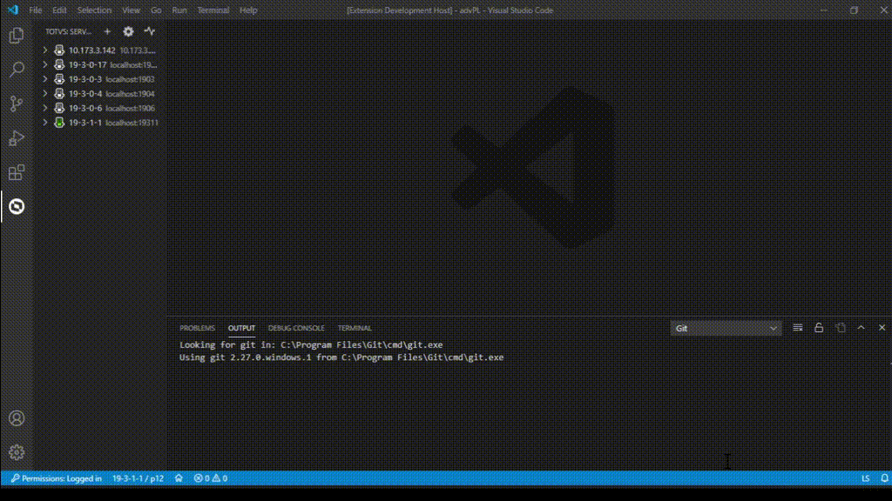
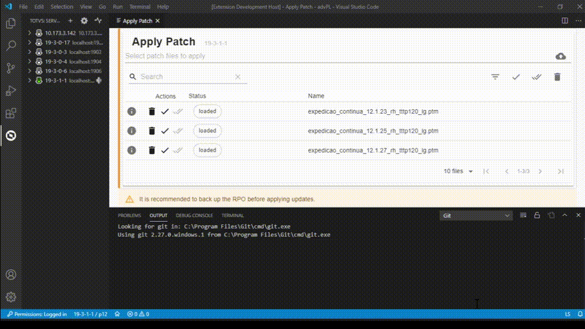
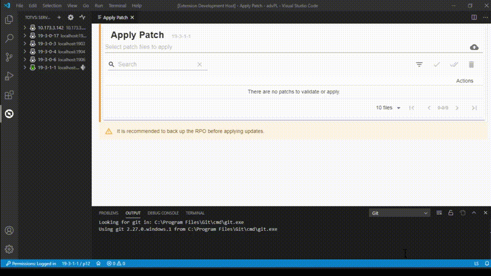
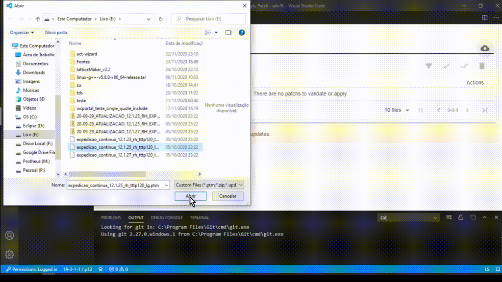
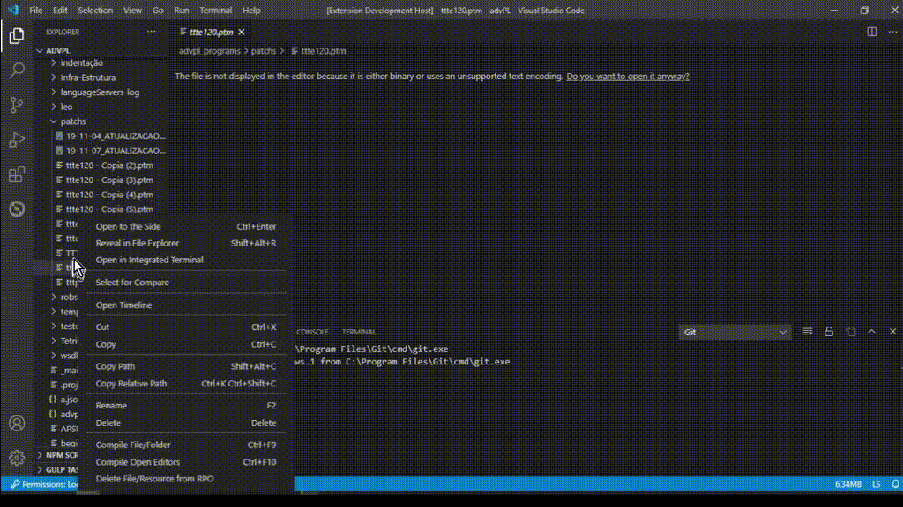

# Aplicando de pacotes de atualização (_patch)

> Requisitos
>
> - servidor/ambiente conectado
> - usuário autenticado (se requerido)
> - acesso ao RPO exclusivo

Auxilia no processo de aplicação de pacotes de atualização (_patchs_).

## Via assistente do servidor

Acesse a visão de ``Servidores``, acione "Aplicar Pacote" no menu de contexto do servidor-alvo e no assistente apresentado, selecione o(s) arquivo(s) de pacotes de atualização que serão aplicados.

> Atalho para a abertura do assistente: `CTRL + SHIFT + P `, digite `TOTVS` e selecione a opção `TOTVS: Patch Apply`.

#### Ações individuais

Na mesma linha de identificação do pacote, você pode acionar ações para cada pacote, individualmente.

Na ordem de apresentação:

Informação | Apresenta painel co informações sobre o pacote.
Remover | Remove o pacote da lista de arquivos a processar.
Validar | Valida o pacote contra o RPO do ambiente corrente.
Aplicar | Aplica o pacote no RPO do ambiente corrente.

#### Ações em lote

Na botoeira de ações, ao acionar uma ação esta será aplicada em todos os pacotes informados..

Na ordem de apresentação:

Filtro | Ativa opção de filtro.
Validar | Valida todos os pacotes contra o RPO do ambiente corrente.
Aplicar | Aplica todos os pacote válidos no RPO do ambiente corrente.
Remover | Remove todos os pacote da lista de arquivos a processar.

#### Arquivo compactado com pacotes

Ao selecionar um arquivo compactado com pacotes, lhe será apresentado o nome do arquivo compactado e uma pequena seta a esquerda. Acione-a para ver os pacotes. As ações descritas, funcionam da mesma forma.

## Via seleção de arquivo

Na visão ``Explorer``, selecione um (ou mais) pacotes de atualizações, acione "Aplicar Pacote do Arquivo" no menu de contexto da seleção. O assistente de aplicação será aberto, já com os arquivos. Siga com os procedimentos acima.

