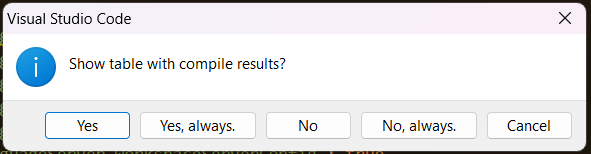
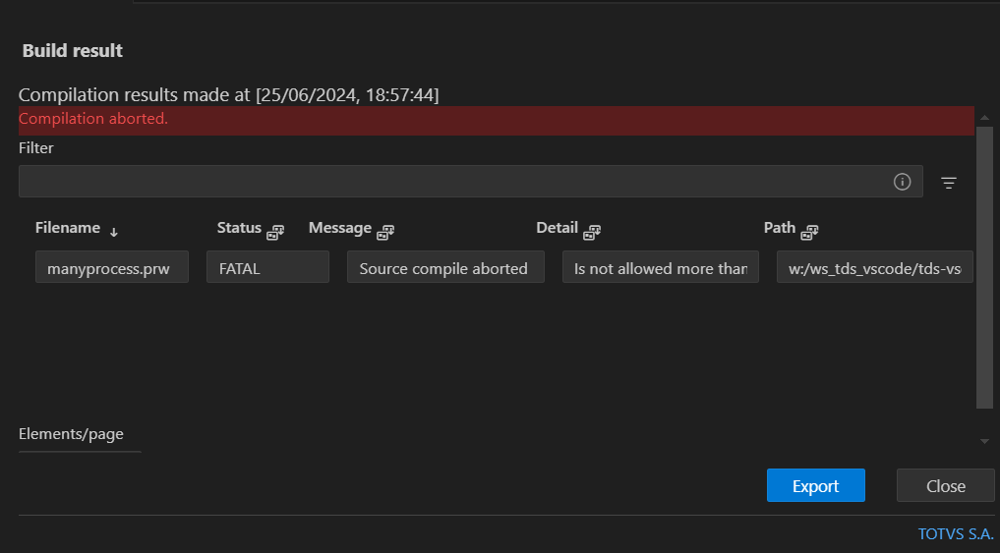

# TDS: Compilação

> **Requisitos**
>
> - servidor/ambiente conectado
> - usuário autenticado (se requerido)
> - pastas para buscas de arquivos de definição (_includes_)
> - acesso exclusivo ao _RPO_
> - chave de compilação (apenas para _functions_ e _main functions_)
>
> Recomenda-se que pastas e arquivos não contenham caracteres especiais e/ou acentuados e sempre em mínusculas de forma a manter a compatibildade entre os diversos sistemas operacionais suportados pelo **TDS-VSCode** e seus componentes.
> Leia [Convenção para nomenclatura de File System em ambiente Linux]<https://tdn.totvs.com/x/h8BICw>).
>
> **Nota**
>
> Arquivos fontes 4GL ignoram a pasta para buscas.

## Sobre o uso de chaves e tokens de compilação

As chaves de compilação ou _tokens_ de compilação empregados na construção do _Protheus_ e suas funcionalidades, são de uso restrito dos _desenvolvedores_ de cada módulo.

Em caso de mau uso destas chaves ou tokens, por qualquer _outra parte_, que não a referida acima, a mesma irá se responsabilizar, direta ou regressivamente, única e exclusivamente, por todos os prejuízos, perdas, danos, indenizações, multas, condenações judiciais, arbitrais e administrativas e quaisquer outras despesas relacionadas ao mau uso, causados tanto à TOTVS quanto a terceiros, eximindo a TOTVS de toda e qualquer responsabilidade.

## Compilando fonte do editor corrente

Para compilar o fonte do editor corrente, acione o atalho `CTRL + F9` (ou `CTRL + SHIFT + F9`) ou `CTRL + SHIFT + P` e execute o comando `TOTVS: Compile Selection`.

> A compilação acionada no editor, sempre irá recompilar o fonte.

## Compilando todos os fontes abertos

Para compilar todos os fontes abertos para edição, acione `CTRL + F10` ou `CTRL + SHIFT + P` e execute o comando `TOTVS: Compile Open Editors`. Para recompilar, acione `CTRL + SHIFT + F10`.

## Compilando arquivos não abertos para edição ou pastas

- Na visão `Explorer`, selecione um ou mais arquivos (ou pastas)
- Acione o menu de contexto sobre a seleção e acione a opção `Compilar` ou `CTRL + F9`

> Para recompilar, acionar o menu de contexto pressionando a tecla `ALT` ou `CTRL + ALT + F9`.

## Resultado da compilação

Após a compilação de múltiplos arquivos, exite a opção de abrir uma tabela com informações de todos os arquivos que foram compilados. Para exibir essa tabela, selecione mais de um arquivo, compile e após a compilação lhe será questionado a apresentação ou não.



Se confirma, uma tabela de resultados semelhante a abaixo será exibida, ordenada pela coluna de resultado.



## Acesso exclusivo ao _RPO_

Para compilar necessitamos de acesso exclusivo ao RPO. Caso contrário, o Application Server retornará um erro de:

> It wasn't possible to obtain exclusive access to the objects repository

Nesse caso você precisará desconectar todos os usuário (inclusive JOBS) que estejam acessando o _RPO_.

Uma forma mais simples é configurar a chave [buildKillUser](https://centraldeatendimento.totvs.com/hc/pt-br/articles/360018481631-MP-ADVPL-ENCERRAR-TODAS-AS-CONEX%C3%95ES-QUANDO-SOLICITADO-UMA-COMPILA%C3%87%C3%83O-) no Application Server e ele fará a desconexão de todos os usuários (e JOBS) antes de efetuar a compilação.

## Configurações de Compilação

O processo de compilação pode ter o seu compoprtamento modificado, acessando
`File | Preferences | Settings | Extensions | TOTVS`. Ao lado esquerdo, selecione a opção e configure conforme desejado.

### Opções

- `..| Clear Console Before Compile`: limpar o console antes de iniciar o processo
- `..| Ask Compile Result`: solicita se deseja ver a tabela de resultados da compilação
- `..| Generate PPO file`: gera o arquivo de pré-processamento (`PPO`)
- `..| Show pre compiler`: apresenta o um log mais detalhado do processo
- `..| Enable extension filter`: ativa o filtro para compilar apenas as extensões reconhecidas pelo editor e/ou plataforma **Protheus**
- `..| Extension Allowed`: lista de extensões permitidas
- `..| Show console on compile`: força a apresentação do console ao iniciar a compilação

### Compilação de _Function_ e _Main Function_

> Este processo está em revisão e pode sofrer alterações.

Para compilar arquivos fontes que contenham _functions_ e/ou _main function_
vovê precisa ter uma chave chave de compilação (ou autorização).

> A partir de **17/05/2019** todas as chaves devem ser regeradas utilizando o ID exibido neste assistente. Isse se faz necessário devido a inclusão do suporte de chave em em Linux e MAC, implementado nesta data.


#### Solicitação

- Na visão de `Servers`, acione o menu de contexto e a opção `Compile Key` ou `CTRL + SHIFT + P` e execute `TOTVS: Compile Key` ou na barra de status o texto `Permissions:`
- Lhe será apresentado o assistente para aplicação de chave. Você enviará o ID da instalação que lhe foi dado para o responsável por geração de chaves (informe-se com o seu superior)
- Aguarde o recebimento do arquivo de autorização (`*.aut`)

#### Aplicação

- Na visão de `Servers`, acione o menu de contexto e a opção `Compile Key` ou `CTRL + SHIFT + P` e execute `TOTVS: Compile Key` ou no texto `Permissions:` na barra de status
- Lhe será apresentado o assistente para aplicação de chave
- Informe o arquivo de autorização (`*.aut`)
- Acione o botão de `Validate` para verificar se a chave é válida
- Se ela foi aceita, acione `Save` ou `Save/Close`

> Pode remover a chave atual, acionando `Clean Key`.

### Configuração de _Include_ (busca de arquivos de definição)

- Na visão de `Servers`, acione o menu de contexto e a opção `Include` ou acione `CTRL + SHIFT + P` e execute `TOTVS: Include`.
- Informe a pasta (ou pastas) para a busca dos arquivos de definição, separadas por `;`

A configuração efetuada via assistente será aplicado em todos os servidores e ambientes por padrão. Para configurar por servidor, abra para edição o arquivo `%USERHOME%/.totvsls/servers.json` ou acione o menu de contexto e a opção `Configure Server View`.

Localize a definição do servidor na sessão `configurations` e adicione/modifique a chave `"includes"`, com a lista de pastas a ser utilizada.

```JSON
{
  ...
  "configurations": [
  {
    "id": "aq9s9aca8qkasjpnxl7rghymvx3bq",
    "type": "totvs_server_protheus",
    ...
    "includes": [
      "C:/totvs/includes1",
      "C:/totvs/includes2",
      "C:/totvs/includes3"
    ],
    ...
  },
  ...
}
```


