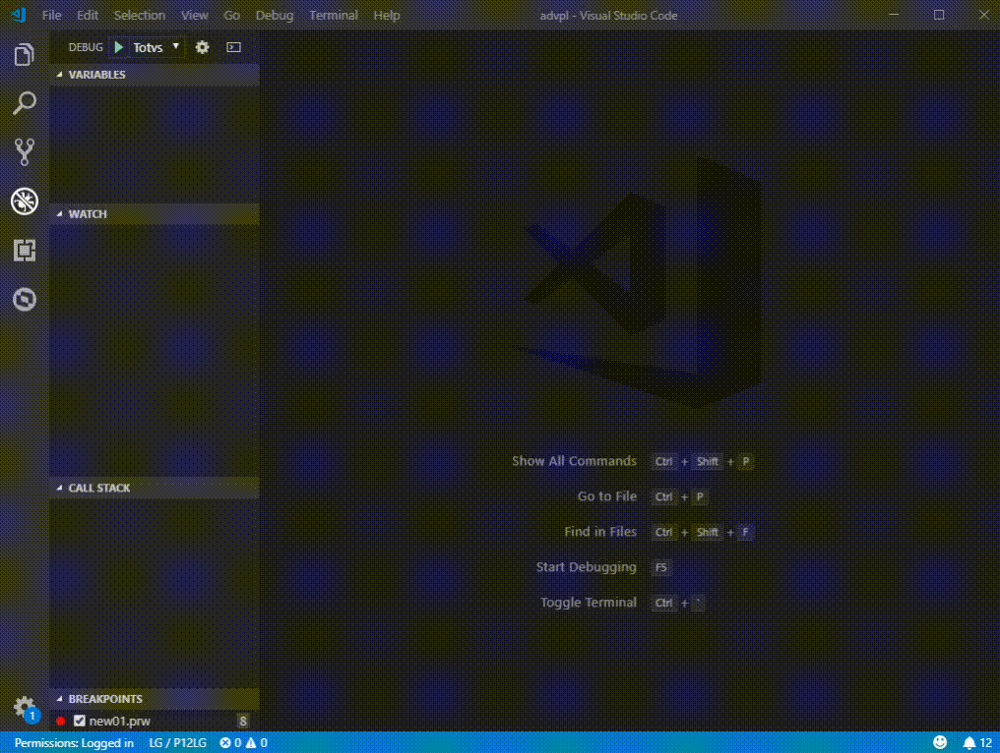
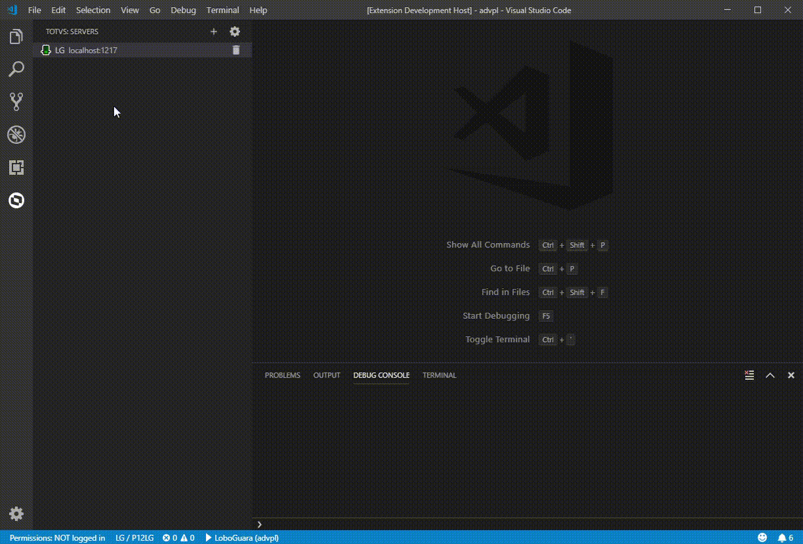
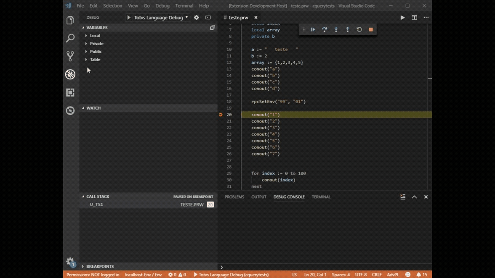
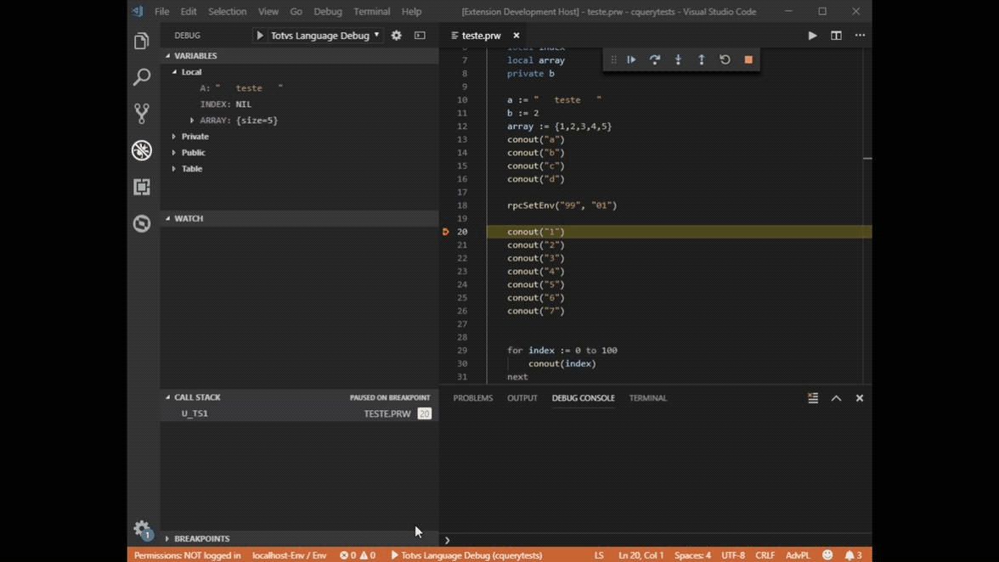

# TDS: Depuração e execução

> Requisitos
>
> - servidor/ambiente conectado
> - usuário autenticado (se requerido)
> - executor configurado

> Recomendações

- **NUNCA** faça depuração em ambiente de produção
- Não use _appServers_ compartilhado com terceiros, mesmo que ambientes diistintos
- Prefira sempre um ambiente local
- **Clientes TCloud** : Os ambientes que estão no _TCloud_ em produção são _bloqueados_ para depuração.
  Promova o _RPO_ para `DEV` e use esse ambiente, e se necessário, promova-o de volta para produção.
  Para detalhes, entre em contato com o suporte do _TCloud_.

> _Por quê não depurar em "produção"?_

> O processo de depuração, é composto de várias partes que se comunicam entre si e muitas vezes, aguardando ações dos usuários (continua, próxima passo, ...).

> Quando estamos em uma depuração, pode ocorrer do VS-Code solicitar uma informação ao _appServer_ e este "congela" todas as _threads_ (conexões/usuário) para atender essa solicitação. Essa "congelada" pode levar até um ou mesmo dois segundos e isso acontece toda vez que o usuário que esta depurando, precisa tomar uma ação (continua, próximo passo...) e isso pode ser sentido por todos os usuários. Além disso o próprio usuário que esta depurando, vai receber informações de cada um dos usuários conectados, gerando uma troca constante de programas fontes ou informações irrelevantes naquele momento.

> O _appServer_ também envia para o VS-Code algumas informações, tais como, "olha estou nesse fonte e nessa linha" e pergunta "O quê quer que eu faça?". Nesse ponto, pode ser necessário o usuário que está depurando, responda com acionamento de uma ação, como por exemplo, "vá para a próxima instrução" ou "execute esta função até terminar". Enquanto o _appServer_ aguarda a resposta do VS-Code, TODAS as _threads_ ficam congeladas. E você foi no banheiro naquele momento. Dentro de alguns minutos terá um enxurrada de reclamações que o servidor travou.

> Isso pode acontecer se tiver um, dez, cem, mil, usuários. Imagina o problema. Cresce exponencialmente ao número de usuários.>

> Outra razão, é que devido ao processo de depuração do _appServer_, normalmente é necessário que o processo de depuração seja o primeiro a ser inicializados, pois somente as _threads_ iniciadas após eles que serão passíveis de depuração e para garantir isso, é comum encerrar na "força" todas as _threds_ no ar, principalmente se a depuração for em _jobs_, _schedullers_, _rest_, e outros do tipo.

> Espero ter esclarecido porquê não deve usar ambiente "produção" em processos de depuração.

## Configuração de executores

> Recomendamos a leitura [Debugging](https://code.visualstudio.com/docs/editor/debugging).

> Por utilizar o Smartclient para iniciar o processo de depuração no Application Server é necessário que o Sistema Operacional onde o tds-vscode está sendo executado, esteja na lista de plataformas homologadas paro o Smartclient conforme [Sistemas operacionais homologados - Smartclient](https://tdn.totvs.com/display/tec/SmartClient+-+Sistemas+operacionais).

### Criando um executor com assistente

Acione o atalho `CTRL + SHIFT + P` e execute `TOTVS: Configure Launchers` que lhe apresentará um assistente de configuração de executores que permite criar uma nova configuração ou editar uma já existente. Preencha as informações solicitadas e acione `Save`.



### Criando um executor manualmente

A definição de executores encontra-se nO arquivo `.vscode/launch.json` que, normalmente, é criado através na abertura da página de `Boas Vindas`. Caso isso não ocorra (devido a configurações do seu ambiente), você pode criá-lo manualmente executando:

- Na barra de atividades, acione o `Debug`
- Na barra de ferramentas (parte superior) da visão de `Debug`, abra a lista de seleção e acione `Add Configuration...`.
- Comece a digitar `TOTVS` e selecione o tipo desejado
  - _totvs_language_debug_, para usar _SmartClient Desktop_
  - _totvs_language_web_debug_, para usar _SmartClient Html_
  - _totvs_language_sigapaf_debug_, para usar _SigaPAF Desktop_
- Preencha os atributos solicitados conforme seu ambiente
- Salve o arquivo

### Exemplos de configuração

```JSON
{
	"version": "0.2.0",
	"configurations": [
    {
    "type": "totvs_language_debug",
    "request": "launch",
    "name": "TOTVS Language Debug",
    "program": "${command:AskForProgramName}",
    "cwb": "${workspaceFolder}",
    "smartclientBin": "/home/totvs12/bin/smartclient/smartclient",
    "isMultiSession": true,
    "enableTableSync": true
    },
    {
      "type": "totvs_language_web_debug",
      "request": "launch",
      "name": "TOTVS Language Debug",
      "program": "${command:AskForProgramName}",
      "cwb": "${workspaceFolder}",
      "smartclientUrl": "http://localhost:8080",
      "isMultiSession": true,
      "enableTableSync": true
    }
  ]
}
```

No caso de efetuar depuração via `SmartClient Html`, indique qual o navegador web será utilizado, no arquivo `.\vscode\settings.json`.

```JSON
{
  ...
  "totvsLanguageServer.web.navigator": "C:\\Program Files\\Mozilla Firefox\\firefox.exe",
  ...
}
```

### <a name="variable"></a>Variáveis de substituição

| Veja [Variable substitution](https://code.visualstudio.com/docs/editor/debugging#_variable-substitution).

Os executores do **TDS-VSCode**, além da variáveis de substituição do **VS-Code**, permite o uso de:

| Variável                       | Uso/Função                               |
| ------------------------------ | ---------------------------------------- |
| `${command:AskForProgramName}` | Solicita qual o programa a ser executado |

Ao utilizar `${command:AskForProgramName}` na configuração do executor, lhe será solicitado qual o prorama ou função a ser executada, com ou sem parâmetros.

```ADVPL
user function u_myFunc(p1, p2, p3)
  // processamento conforme parâmetros
  ...
return
```

| Exemplos              | Parâmetros                     |
| --------------------- | ------------------------------ |
| `u_myFunc`            | `p1`=nil, `p2`=nil, `p3`=nil   |
| `u_myFunc()`          | `p1`=nil, `p2`=nil, `p3`=nil   |
| `u_myFunc("A")`       | `p1`="A", `p2`=nil, `p3`=nil   |
| `u_myFunc("A",,3)`    | `p1`="A", `p2`="", `p3`="3"    |
| `u_myFunc("A",.t.,3)` | `p1`="A", `p2`=".t.", `p3`="3" |

| A passagem de parâmetros equivale a usar o argumento `-a` do `SmartClient`.

## Execução

Acione o atalho `CTRL + F5` para iniciar a execução e informe o nome da função/programa a ser executado, se solicitado.

> Veja [Variáveis de substituição](#variable).

## Depuração

Acione o atalho `F5` para iniciar a depuração e informe o nome da função/programa a ser executada, se solicitado.

| Veja [Debuggimg Actions](https://code.visualstudio.com/docs/editor/debugging#_debug-actions) e [Variáveis de substituição](#variable).



É possível verificar valores de variáveis, conteúdo de tabelas e executar métodos/funções durante o processo de depuração.

- Coloque um ponto de parada onde achar necessário
- Quando a depuração parar no ponto indicado, abra a visão `Debug Console`
- Digite uma operação ou variável AdvPL/4GL disponível em seu ambiente de depuração
- Para ver conteúdo de uma tabela, digite `table:nome_da_tabela`, por exemplo `table:SM0`

### Usando Console de Depuração

| Veja (Debug Console REPL)[https://code.visualstudio.com/docs/editor/debugging#_debug-console-repl]


### Sincronismo de tabelas durante a depuração



O sincronismo de tabelas pode ser alterado por configuração no executor, usando a chave `enableTableSync`. Por padrão, vem habilitado.


Também é possível alterar essa opção durante o processo de depuração acionando o atalho `CTRL + SHOFT + P`, executando `TOTVS: Toggle table sync`. Note que ao usar esse comando, o parâmetro do executor é alterado, portanto na próxima depuração irá utilizar essa definição.




## Depuração de serviços (_jobs_)

| A principal característica de um serviço, é que a sua execução não esta diretamente relacionada a interface com o usuário (_SmartClient_) e normalmente, é executado em segundo plano pelo _appServer_.

### Preparação para serviços REST

1. No arquivo de configuração do _appServer_ (`ini`), comente a sessão `[OnStart]`.
1. Ainda no arquivo de configuração do _appServer_, na sessão `[General]` e ajuste a chave `BUILDKILLUSERS=1`.
1. Reinicie a execução do _appServer_.
1. Abra o arquivo `.vscode\launch.json`.
1. Localize a definição de executor que será utilizada e adicione a chave `"enableMultiThread": true`.
1. Crie um arquivo-fonte e adicione o código abaixo, adequando-o se necessário.

```
user function startRest()
  //O nome do job REST e ambiente de execução dele, podem ser obtidos no arquivo
  //de configuração do _appServer_.
  //Detalhes da função em https://tdn.totvs.com/display/tec/StartJob
  startjob("HTTP_START", "p12", .f.) //lwait, sempre dever ser false
  sleep(15000) //aguarda o serviço ser inicializado. Ajuste o tempo se necessário.
  alert(">> Serviço REST inicializado. <<")
return
```

### Preparação para outros serviços

1. No arquivo de configuração do _appServer_ (`ini`), na sessão `[OnStart]` deixe ativo somente os serviços necessários na depuração e na chave `RefreshRate`, informe o intervalo de `30` segundos.
1. Ainda no arquivo de configuração do _appServer_, na sessão `[General]`, ajuste a chave `BUILDKILLUSERS=1`.
1. Reinicie a execução do _appServer_.
1. Abra o arquivo `.vscode\launch.json`.
1. Localize a definição de executor que será utilizada e adicione a chave `"enableMultiThread": true`;

### Execução da Depuração

1. Encerre todos os serviços e conexões.
   _**Dica**: Compilar qualquer fonte, encerra todos os serviços e conexões existentes._
1. Coloque um ponto de parada que será executado quando o serviço for requisitado.
1. Iniciar a depuração executando qualquer função do _RPO_ para que mantenha uma conxão do depurador com o _appServer_.
   Se serviço _REST_, execute a função `u_startRest` e aguarde a mensagem de serviço inicializado.
1. Acione o serviço por fora do **VS-CODE**, por exemplo executando o `SmartClient`, uma requisição (http, rest, etc)
1. Quando a depuração parar no ponto de parade, prossiga com a depuração normalmente.
