# TDS: Depuração e execução

> Requisitos

- servidor/ambiente conectado
- usuário autenticado (se requerido)
- executor configurado

> Recomenda-se que pastas e arquivos não contenham caracteres especiais e/ou acentuados e sempre em mínusculas de forma a manter a compatibilidade entre os diversos sistemas operacionais suportados pelo **TDS-VSCode** e seus componentes.
> Leia [Convenção para nomenclatura de File System em ambiente Linux]<https://tdn.totvs.com/x/h8BICw>).
>
> Recomendações
>
> - **NUNCA** faça depuração em ambiente de produção.
> - **NÃO** utilize o _SIGAMDI_ nem o _SIGAADV_ para realizar uma depuração, utilize diretamente os módulos.
> - Não use _appServers_ compartilhado com terceiros, mesmo que ambientes distintos.
> - Prefira sempre um ambiente local durante a depuração.
> - **Clientes TCloud**: Os ambientes que estão no _TCloud_ em produção são _bloqueados_, por padrão, para depuração.
>   Promova o _RPO_ para `DEV` e use esse ambiente, e se necessário, promova-o de volta para produção.
>   Para detalhes, entre em contato com o suporte do _TCloud_.

## _Por quê não depurar em "produção"?_

O processo de depuração, é composto de várias partes que se comunicam entre si e muitas vezes, aguardando ações dos usuários (continua, próxima passo, ...).

Quando estamos em uma depuração, pode ocorrer do VS-Code solicitar uma informação ao _appServer_ e este "congela" todas as _threads_ (conexões/usuário) para atender essa solicitação. Essa "congelada" pode levar até um ou mesmo dois segundos e isso acontece toda vez que o usuário que esta depurando, precisa tomar uma ação (continua, próximo passo...) e isso pode ser sentido por todos os usuários. Além disso o próprio usuário que esta depurando, vai receber informações de cada um dos usuários conectados, gerando uma troca constante de programas fontes ou informações irrelevantes naquele momento.

O _appServer_ também envia para o VS-Code algumas informações, tais como, "olha estou nesse fonte e nessa linha" e pergunta "O quê quer que eu faça?". Nesse ponto, pode ser necessário o usuário que está depurando, responda com acionamento de uma ação, como por exemplo, "vá para a próxima instrução" ou "execute esta função até terminar". Enquanto o _appServer_ aguarda a resposta do VS-Code, TODAS as _threads_ ficam congeladas. E você foi no banheiro naquele momento. Dentro de alguns minutos terá um enxurrada de reclamações que o servidor travou.

Isso pode acontecer se tiver um, dez, cem, mil, usuários. Imagina o problema. Cresce exponencialmente ao número de usuários.>

Outra razão, é que devido ao processo de depuração do _appServer_, normalmente é necessário que o processo de depuração seja o primeiro a ser inicializados, pois somente as _threads_ iniciadas após eles que serão passíveis de depuração e para garantir isso, é comum encerrar na "força" todas as _threads_ no ar, principalmente se a depuração for em _jobs_, _schedulers_, _rest_, e outros do tipo.

Espero ter esclarecido porquê não deve usar ambiente "produção" em processos de depuração.

## Configuração de executores

> Recomendamos a leitura [Debugging](https://code.visualstudio.com/docs/editor/debugging).

Por utilizar o SmartClient para iniciar o processo de depuração no Application Server é necessário que o Sistema Operacional onde o tds-vscode está sendo executado, esteja na lista de plataformas homologadas paro o SmartClient conforme [Sistemas operacionais homologados - SmartClient](https://tdn.totvs.com/display/tec/SmartClient+-+Sistemas+operacionais).

### Criando um executor com assistente

Acione o atalho `CTRL + SHIFT + P` e execute `TOTVS: Configure Launchers` que lhe apresentará um assistente de configuração de executores que permite criar uma nova configuração ou editar uma já existente. Preencha as informações solicitadas e acione `Save`.


> Observação: A seleção do `Smartclient` no MacOS não é suportada. Veja em [Smartclient MacOS](#sc-macos) como configurar manualmente um executor do Smartclient para o MacOS.

### Criando um executor manualmente

A definição de executores encontra-se no arquivo `.vscode/launch.json` que, normalmente, é criado através na abertura da página de `Boas Vindas`. Caso isso não ocorra (devido a configurações do seu ambiente), você pode criá-lo manualmente executando:

- Na barra de atividades, acione o `Debug`
- Na barra de ferramentas (parte superior) da visão de `Debug`, abra a lista de seleção e acione `Add Configuration...`.
- Comece a digitar `TOTVS` e selecione o tipo desejado
    - _totvs_language_debug_, para usar _SmartClient Desktop_ (padrão)
    - _totvs_language_web_debug_, para usar _SmartClient Html_
    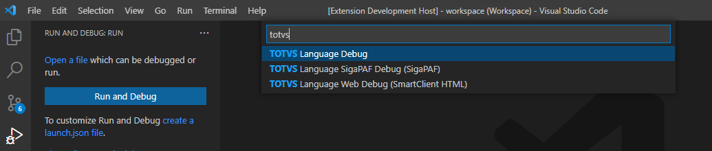
- Preencha os atributos solicitados conforme seu ambiente
- Salve o arquivo

## Exemplos de configuração

### TOTVS Language Debug (padrão)

```JSON
{
  "version": "0.2.0",
  "configurations": [
    {
    "type": "totvs_language_debug",
    "request": "launch",
    "name": "TOTVS Language Debug",
    "program": "${command:AskForProgramName}",
    "cwb": "${workspaceFolder}",
    "smartclientBin": "c:/totvs12/bin/smartclient/smartclient.exe",
    "isMultiSession": true,
    "enableTableSync": true
    }
  ]
}
```

### TOTVS Language Web Debug (HTML)

```JSON
{
  "version": "0.2.0",
  "configurations": [
    {
      "type": "totvs_language_web_debug",
      "request": "launch",
      "name": "TOTVS Language Debug",
      "program": "${command:AskForProgramName}",
      "cwb": "${workspaceFolder}",
      "isMultiSession": true,
      "enableTableSync": true
    }
  ]
}
```

> IMPORTANTE:
>
> A propriedade `smartclientUrl` passa a ser considerada obsoleta. Informe-a  apenas sob orientação.
> Caso não seja informada, a URL será montada utilizando os parâmetros atuais de conexão do servidor.

Ao iniciar a depuração web, se a chaves `totvsLanguageServer.web.navigator` (ou `webNavigator`) não seja informada, será utilizado o navegador padrão do sistema operacional.

Caso queira usar um navegador específico, é necessário informar qual será utilizado. Configure o caminho completo do navegador web através das preferências de usuário, clicando em `Arquivo > Preferências > Configurações` e procure por `Web: Navigator`. Note que existem duas seções distintas, a de `Usuário` e a de `Workspace`. Aconselhamos a utilizar as configurações de `Usuário` que será utilizada por todas as `Workspaces` do usuário. Caso seja necessária uma configuração específica e diferente em uma `Workspace`, configure na seção `Workspace` e neste caso apenas esta `Workspace` será afetada.

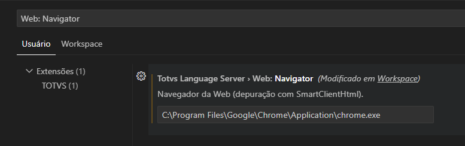

Caso queira modificar o comportamento do navegador no momento da sua inicialização, você pode informar uma lista de argumentos que serão passados para o navegador via linha de comandos. Por exemplo, para forçar a abertura de uma nova janela no `FireFox`, informe na lista `Web: Navigator Arguments` (ou `web.arguments` no executor) com o valor `["-new-window"]`. Para maiores detalhes, consulte a documentação do seu navegador.

> Requer que a chave `totvsLanguageServer.web.navigator` ou `webNavigator` seja informada.

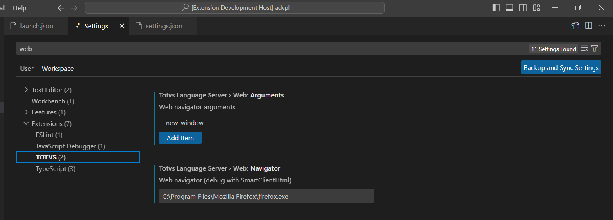

| Navegador |
| --------- |
| [Firefox](https://wiki.mozilla.org/Firefox/CommandLineOptions) |
| [Chromium](https://www.chromium.org/developers/how-tos/run-chromium-with-flags/) |
| [Edge](https://textslashplain.com/2022/01/05/edge-command-line-arguments/) Não oficial |

> Páginas acessadas em Maio/2024.

| Devido a uma limitação na execução do navegador `Safari` por linha de comando, este navegador não é suportado para depuração via `SmartClient HTML`.

## SmartClient MacOS<a name="sc-macos"></a>

A configuração do parâmetro `smartclientBin` para o MacOS deve seguir o exemplo a seguir.


## <a name="variable"></a>Variáveis de substituição

| Veja [Variable substitution](https://code.visualstudio.com/docs/editor/debugging#_variable-substitution).

Os executores do **TDS-VSCode**, além da variáveis de substituição do **VS-Code**, permite o uso de:

| Variável                       | Uso/Função                               |
| ------------------------------ | ---------------------------------------- |
| `${command:AskForProgramName}` | Solicita qual o programa a ser executado |

Ao utilizar `${command:AskForProgramName}` na configuração do executor, lhe será solicitado qual o prorama ou função a ser executada, com ou sem parâmetros.

```ADVPL
user function u_myFunc(p1, p2, p3)
  // processamento conforme parâmetros
  ...
return
```

| Exemplos              | Parâmetros                     |
| --------------------- | ------------------------------ |
| `u_myFunc`            | `p1`=nil, `p2`=nil, `p3`=nil   |
| `u_myFunc()`          | `p1`=nil, `p2`=nil, `p3`=nil   |
| `u_myFunc("A")`       | `p1`="A", `p2`=nil, `p3`=nil   |
| `u_myFunc("A",,3)`    | `p1`="A", `p2`="", `p3`="3"    |
| `u_myFunc("A",.t.,3)` | `p1`="A", `p2`=".t.", `p3`="3" |

| A passagem de parâmetros equivale a usar o argumento `-a` do `SmartClient`.

## Execução

Acione o atalho `CTRL + F5` para iniciar a execução e informe o nome da função/programa a ser executado, se solicitado.

> Veja [Variáveis de substituição](#variable).

## Depuração

Acione o atalho `F5` para iniciar a depuração e informe o nome da função/programa a ser executada, se solicitado.

> Veja [Debuggimg Actions](https://code.visualstudio.com/docs/editor/debugging#_debug-actions) e [Variáveis de substituição](#variable).


É possível verificar valores de variáveis, conteúdo de tabelas e executar métodos/funções durante o processo de depuração.

- Coloque um ponto de parada onde achar necessário
- Quando a depuração parar no ponto indicado, abra a visão `Debug Console`
- Digite uma operação ou variável AdvPL/4GL disponível em seu ambiente de depuração
- Para ver conteúdo de uma tabela, digite `table:nome_da_tabela`, por exemplo `table:SM0`

### Usando Console de Depuração

> Veja [Debug Console REPL](https://code.visualstudio.com/docs/editor/debugging#_debug-console-repl).


### Sincronismo de tabelas durante a depuração


O sincronismo de tabelas pode ser alterado por configuração no executor, usando a chave `enableTableSync`. Por padrão, vem habilitado.


Também é possível alterar essa opção durante o processo de depuração acionando o atalho `CTRL + SHIFT + P`, executando `TOTVS: Toggle table sync`. Note que ao usar esse comando, o parâmetro do executor é alterado, portanto na próxima depuração irá utilizar essa definição.


## Depuração HTML (webapp)

Ao iniciarmos uma depuração através de uma configuração 'totvs_language_web_debug' o processo é praticamente o mesmo de uma depuração normal.

A diferença será que ao invés de abrir o Smartclient desktop, será aberta a URL do webapp configurado no launcher no navegador configurado no _settings_.

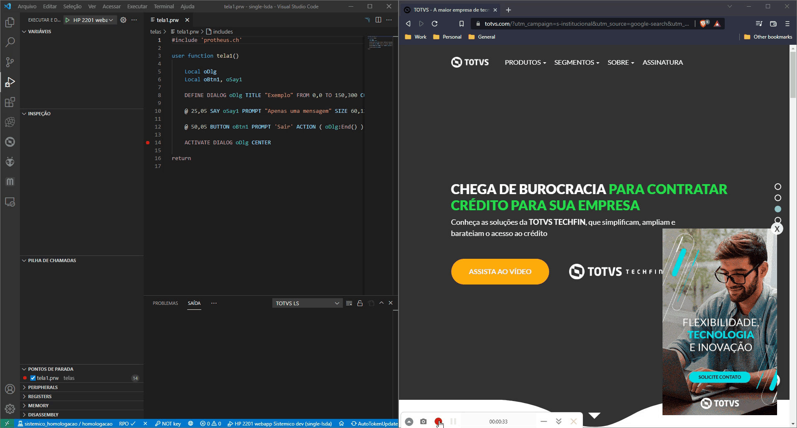

O restante será basicamente o mesmo, respeitando os pontos de paradas e exibindo as informações fornecidas pelo _appServer_.

## Depuração de serviços (_jobs_)

| A principal característica de um serviço, é que a sua execução não esta diretamente relacionada a interface com o usuário (_SmartClient_) e normalmente, é executado em segundo plano pelo _appServer_.

### Preparação para serviços REST

1. No arquivo de configuração do _appServer_ (`ini`), comente a sessão `[OnStart]`.
1. Ainda no arquivo de configuração do _appServer_, na sessão `[General]` e ajuste a chave `BUILDKILLUSERS=1`.
1. Reinicie a execução do _appServer_.
1. Abra o arquivo `.vscode\launch.json`.
1. Localize a definição de executor que será utilizada e adicione a chave `"enableMultiThread": true`.
1. Crie um arquivo-fonte e adicione o código abaixo, adequando-o se necessário.

```ADVPL
user function startRest()
  //O nome do job REST e ambiente de execução dele, podem ser obtidos no arquivo
  //de configuração do _appServer_.
  //Detalhes da função em https://tdn.totvs.com/display/tec/StartJob
  startjob("HTTP_START", "p12", .f.) //lwait, sempre dever ser false
  sleep(15000) //aguarda o serviço ser inicializado. Ajuste o tempo se necessário.
  alert(">> Serviço REST inicializado. <<")
return
```

### Preparação para outros serviços

1. No arquivo de configuração do _appServer_ (`ini`), na sessão `[OnStart]` deixe ativo somente os serviços necessários na depuração e na chave `RefreshRate`, informe o intervalo de `30` segundos.
1. Ainda no arquivo de configuração do _appServer_, na sessão `[General]`, ajuste a chave `BUILDKILLUSERS=1`.
1. Reinicie a execução do _appServer_.
1. Abra o arquivo `.vscode\launch.json`.
1. Localize a definição de executor que será utilizada e adicione a chave `"enableMultiThread": true`;

### Execução da Depuração

1. Encerre todos os serviços e conexões.
   _**Dica**: Compilar qualquer fonte, encerra todos os serviços e conexões existentes._
1. Coloque um ponto de parada que será executado quando o serviço for requisitado.
1. Iniciar a depuração executando qualquer função do _RPO_ para que mantenha uma conxão do depurador com o _appServer_.
   Se serviço _REST_, execute a função `u_startRest` e aguarde a mensagem de serviço inicializado.
1. Acione o serviço por fora do **VS-CODE**, por exemplo executando o `SmartClient`, uma requisição (http, rest, etc)
1. Quando a depuração parar no ponto de parada, prossiga com a depuração normalmente.

## Depuração de PO UI

| Existe uma particularidade encontrada nas novas rotinas de PO UI. Elas rodam em um processo diferente do executado inicialmente, então ao depurar estes processos, precisamos realizar uma pequena configuração, caso não esteja ativada ainda.

### Preparação para rotinas PO UI

1. Abra o arquivo `.vscode\launch.json`.
1. Localize a definição de executor que será utilizada e adicione a chave `"enableMultiThread": true`.
1. Quando a depuração parar no ponto de parada, prossiga com a depuração normalmente.

## Funcionalidades estendidas de depuração

Por padrão, as funcionalidades estendidas estão desligadas. Para ligá-las, adicionar na configuração do lançador de depuração a chave ``extend.Features``, ligando as funcionalidades que deseja ativar.

Algo semelhante a:

```ADVPL
{
	"version": "0.2.0",
	"configurations": [
		{
			"type": "totvs_language_debug",
			"request": "launch",

      ...

      "extendFeatures": {
				"charDetails": true
			}
		}
	],

...

}
```

### Funcionalidade estendida: ``charDetails``

Quando desligada (padrão) a depuração de tipos ``char`` (_string_), não apresenta alteração e e ativada, passa a apresentar detalhes sobre a variável/campo, mudando a forma de visualização.

| Desligada | Ligada |
| --------- | ------ |
| 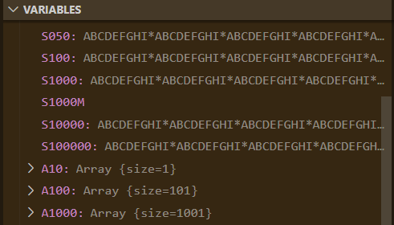 | 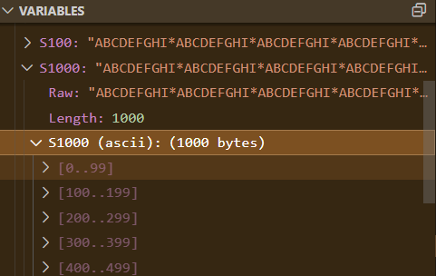 |

Variáveis do tipo _string_ (_character_), podem conter dados nos formatos CP1252/CP1251 ou UTF8, que podem ser diferenciadas pelo prefixo ``UTF8`` em seus valores nas visões ``Variables`` e ``Watches`` e ao passar o mouse sobre a variável.

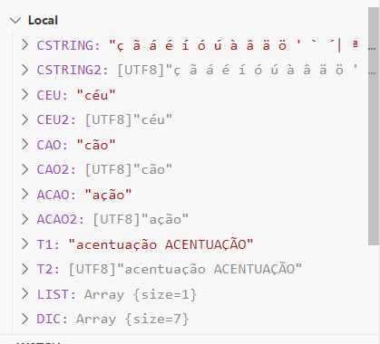

Na imagem acima, ``<variável>`` esta com conteúdo CP1252 (padrão AdvPL) e ``<variável2>``, o conteúdo é UTF8.
Ao expandir a ``<variável>``, você obterá mais detalhes.

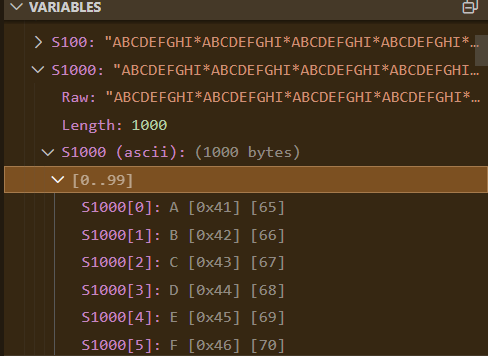

Onde:

| | |
| - | - |
| ``Raw`` | É o dado bruto (como armazenado na memória do Protheus). |
| ``Length`` | É o tamanho da _string_ do dado bruto. |
| ``<variável> (ASCII)``   | Sequencia _byte_ a _byte_ da _string,_ apresentando o caractere ASCII, seu código em hexadecimal e seu código decimal. |

Ao utilizar o _console de debug (REPL)_ para entrada de expressões, esta será tratada para apresentar da mesma forma.
Lembre-se que o padrão é CP1252/CP1251.

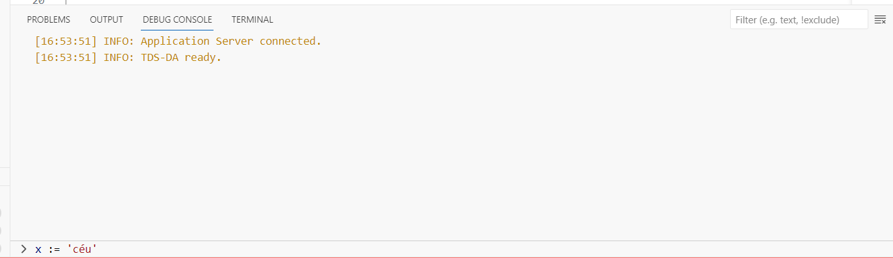
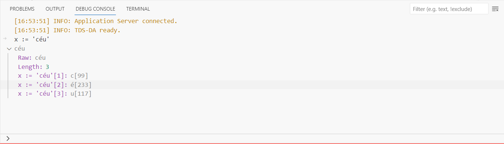

Caso queira informar conteúdo em UTF-8, deverá usar a função ``encodeUTF8``.

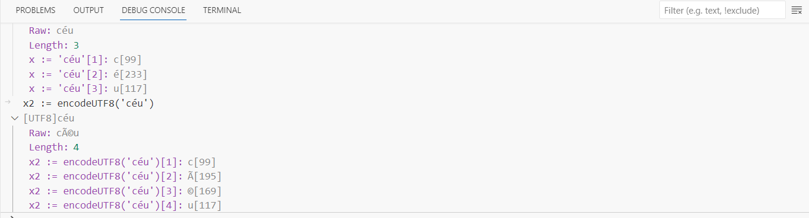

Ao comparar variáveis com conteúdo em formato diferente, sempre resultará em ``.F.`` (veja a sequencia de _bytes_).

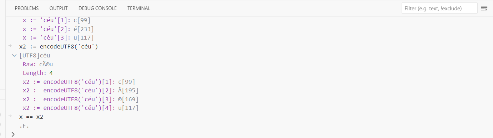

Outras operações com _strings_ terão comportamento diferente se o conteúdo for UTF8.

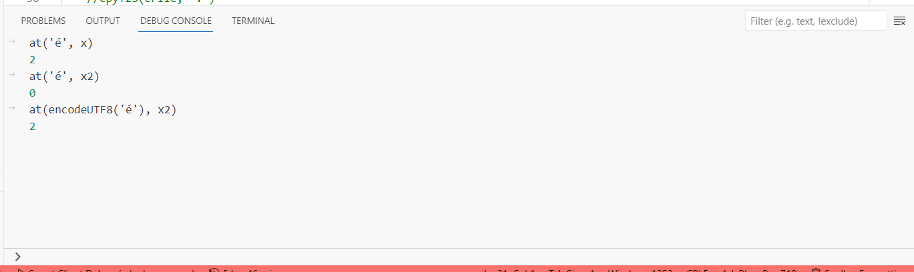
