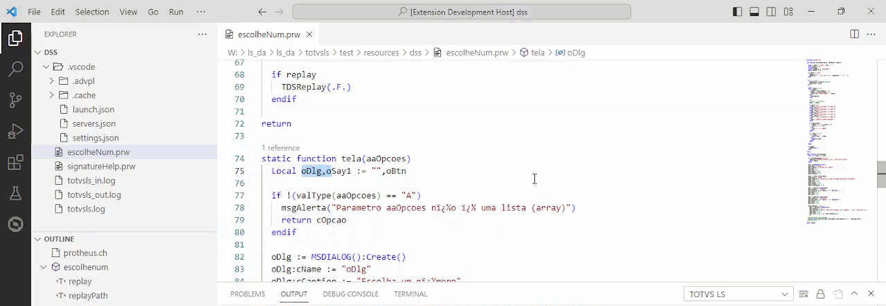
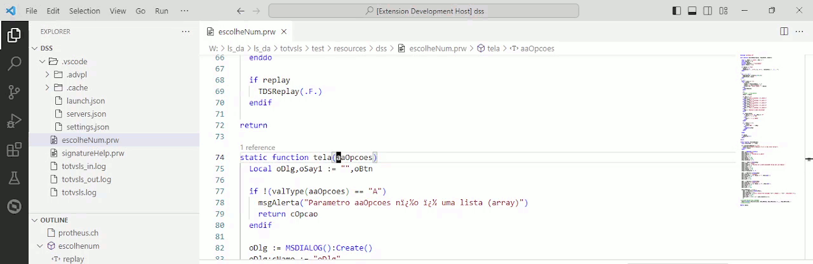
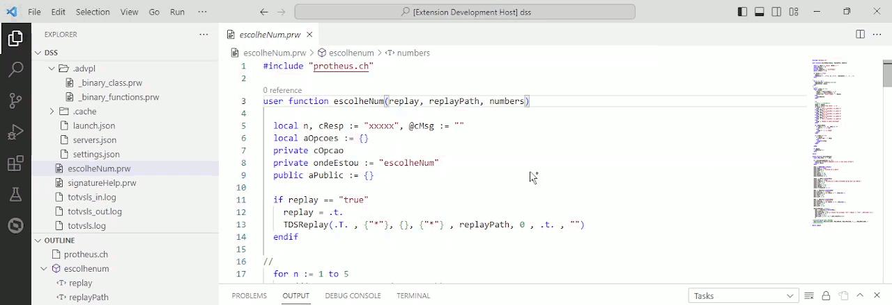
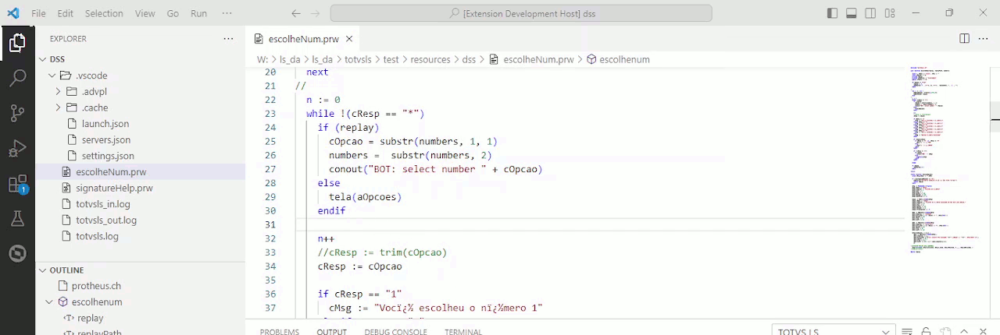
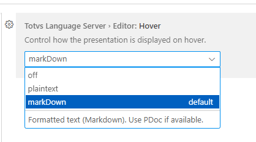
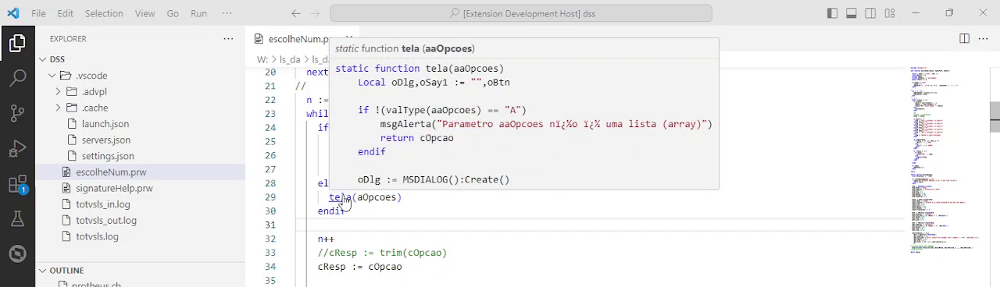

# TDS: Developer Support Subsystem

> Requisitos

- DSS (Developer Support Subsystem)_em execução (inicio automático, em paralelo com o_Language Server_)
- Resultados podem ser parciais devido ao processo de indexação em andamento

> Recomenda-se que pastas e arquivos não contenham caracteres especiais e/ou acentuados e sempre em mínusculas de forma a manter a compatibildade entre os diversos sistemas operacionais suportados pelo **TDS-VSCode** e seus componentes.
> Leia [Convenção para nomenclatura de File System em ambiente Linux]<https://tdn.totvs.com/x/h8BICw>).

Saiba todas as opções disponíveis em [Code Navigation](https://code.visualstudio.com/docs/editor/editingevolved) e aqui, breve documentação das opções suportadas em projetos baseados nas linguagens **TOTVS**.

> As opções de acionamento citadas são as configurações padrão do **VS-Code**, podendo ser diferentes em função de reconfiguração efetuada pelo usuário ou outras extensões.
> Algumas operações  de navegação também pode ser acionadas via menu de contexto do editor.

|        | Funcionalidades futuras |
| ------ | -------------- |
|        | Destaque visual para código isolado por ``#ifdef``. |
|        | Strings de tradução (visualização e edição). |
|        | Suporte a AdvPL/Asp (congelado) |

## [Navegação rápida (_Quick file navigation_)](https://code.visualstudio.com/docs/editor/editingevolved#_quick-file-navigation)

**Acionamento:** ``Ctrl+P`` ou ``F1`` (iniciar com vazio) e inicie a digitação para o filtro por nome do arquivo.


## [Trilha (_Breadcrumbs_)](https://code.visualstudio.com/docs/editor/editingevolved#_breadcrumbs)

**Acionamento:** Você pode ativar ou desativar a trilha via ``View > Appearence > Show Breadcrumbs`` ou com a configuração ``breadcrumbs.enabled``.


## [Ir para definição (_Go to definition_)](https://code.visualstudio.com/docs/editor/editingevolved#_go-to-definition)

**Acionamento:** ``Ctrl+Click`` (abre) ou ``Ctrl+Alt+Click`` (abre ao lado) ou ``F12`` sobre uma chamada de função ou variável.



## [Ir para um símbolo (_Go to symbol_)](https://code.visualstudio.com/docs/editor/editingevolved#_go-to-symbol)

**Acionamento:** ``Ctrl+Shift+O`` ou ``F1`` (iniciar com ``@``) e inicie a digitação para o filtro por nome do simbolo.



> No _prompt_ do filtro, informe ``@:`` para agrupar os elementos.



## [Abrir símbolo por nome (_Open symbol by name_)](https://code.visualstudio.com/docs/editor/editingevolved#_open-symbol-by-name)

**Acionamento:** ``Ctrl+T`` ou ``F1`` (iniciar com ``#``) e inicie a digitação para o filtro por nome do símbolo.


## [Visualizar (_Peek_)](https://code.visualstudio.com/docs/editor/editingevolved#_peek)

**Acionamento:** ``Alt+F12`` sobre uma chamada de função ou variável.


## [Passagem de mouse (_Show hover_)](https://code.visualstudio.com/api/language-extensions/programmatic-language-features#show-hovers)

**Acionamento:** Passe o ponteiro do mouse sobre o item a ser visualizado.



> Você pode ativar ou desativar a passagem de mouse em ``View > Text Editor > Hover: Enabled`` ou mudar o formato de apresentação em ``File > Preference > Settings > Extension > TOTVS > Totvs Language Server > Editor: Hover``.



Os formatos disponíveis são:

| Opção | Comportamento |
| `off` | Desativa a apesentação. |
| `plain text` | Apresenta a documentação em um formato simples. |
| `markdown` | Apresenta a documentação formatada. |

> Para as duas últimas, ``View > Text Editor > Hover: Enabled`` deve estar habilitado.

## [Mostrar definições de um símbolo (_Show definitions of a symbol_)](https://code.visualstudio.com/api/language-extensions/programmatic-language-features#show-definitions-of-a-symbol)

**Acionamento:** ``Ctrl+<passagem ponteiro do mouse>`` sobre o item a ser visualizado. Se este ficar destacado com um sublinhado, pode ir para definição acionando ``Ctrl+<acionamento do mouse>``.

hover-show-symbol


## [Assistente de assinatura em funções (_Signature help_)](https://code.visualstudio.com/api/language-extensions/programmatic-language-features#help-with-function-and-method-signatures)

**Acionamento:** Automático ao acionar ``(`` após um identificador de função/método ou ``ctrl+shitf+space``, na lista de argumentos.


> Funciona apenas para funções/métodos, cujo fonte esteja no seu projeto ou para funções/métodos AdvPL binários (definidas no núcleo da linguagem).

## [Informação/Referências (_Reference information_)](https://code.visualstudio.com/docs/editor/editingevolved#_reference-information)


> Em **métodos** o valor apresentado pode não ser preciso.

**Acionamento:** Ativação efetuada pela configuração ``editor.codeLens``, sendo que o padrão é ativado.

> Para configurar somente para fontes **TOTVS**, use a configuração ``totvsLanguageServer.editor.codeLens``.

## (#cache)</a>Cache de navegação

> Usuários ``Git``, ``SVN``, ``CVS`` e similares: O conteúdo da pasta ``.vscode/.advpl`` é inicializado a cada sessão do **VS-Code**, portanto, recomenda-se ignorar essa pasta nos processos de versionamento.

Por padrão, a extensão utiliza um _cache_ em memória, que é gerado na inicialização da extensão.
Em alguns casos, pode ser interessante manter esse _cache_ entre sessões, ou seja, ter um _cache_ persistente.

Para ajustar o comportamento acesse ``File > Preference > Settings``, filtre por ``totvsLanguageServer.editor`` e localize ``Totvs Language Server › Editor › Index: Cache``, configurando o comportamento:

| Opção | Comportamento |
| ----- | ------------- |
| `off` | O _cache_  desligado. |
| `onMemory` | O _cache_ ligado e em memória. |
| `onDisk` | O _cache_ é armazenado em disco, para uso nas próximas sessões. |

A opção ``off``, atuará somente nos fontes abertos para edição e o **DSS** terá  limitações em suas funcionalidades. A ``onMemory``, o _cache_ é mantido em memória, sendo recriado a cada nova sessão de uso do **VS-Code**, com o  **DSS** totalmente funcional, incluindo arquivos não abertos para edição. A opção ``onDisk``, persiste o _cache_ em disco, em diversos blocos (arquivos), procurando distribuir o custo de leitura/gravação (I/O) em disco e minimizando eventuais corrupções do _cache_.

> Devido ao escopo de atuação da opção ``off`` em relação as demais opções, os resultados das ações de navegações e de informação, podem variar para o mesmo fonte e elemento.

## Ignorar pastas e arquivos

### Definição

`.tdsindexignore` é um arquivo dentro da pasta do projeto (ou sub-pastas) que ignora/impede que os arquivos sejam indexados, lembrando que essa configuração afetará a [navegação em fontes](./dss.md).

O uso do `.tdsindexignore` é similar aos usados em outras extensões/aplicativos, p.e. `.gitignore`, `.vscodeignore` e outros.

### Sintaxe

- O `.tdsindexignore` pode ser colocado em qualquer pasta ou sub-pastas, sendo que será aplicado de forma recursiva na pasta e sub-pastas, onde esta armazenado;

- Cada linha do arquivo, é formado por uma _string_ que representa o padrão de nome de pastas e arquivos que serão ignorados ou não. Para formar o padrão, use:

| Curinga | Uso |
| - | - |
| `?` | Um caracter desconhecido. |
| `*` | Um ou mais caracteres desconhecidos. |
| `.` | Pasta corrente. |
| `!` | Nega a expressão, forçando o processamento do arquivo. |
| `@` | Expressão regular [`Perl`](https://perldoc.perl.org/perlre). |

> A aplicação dos padrões de seleção não são sensíveis a caixa (maiúsculas e minúsculas).
> Informe primeiro as regras mais restritivas.
> Ao colocar o arquivo ``.tdsindexignore`` em uma pasta, este será aplicado na pasta onde foi criado e em suas sub-pastas.
> Linhas em branco não tem efeito
> Evite usar nomes acentuados.

### Exemplos

#### Área de trabalho

```text
root
  \- api
  |  |- .tdsindexignore
  |  |- api_product.prw
  |  |- api_customer.prw
  |  |- api_order.prw
  |  |- api_my_test.prw
  |  |- dbacess1.prw
  |  |- dbacess2.prw
  \- app
  |  |- app.prw
  |  |- utils.prw
  |  |- dbacess1.prw
  |  |- dbacess2.prw
  |  |- app_my_test.prw
  \- test
  |  | .tdsindexignore
  |  \- unit
  |  |  |- test_product.prw
  |  |  |- test_customer.prw
  |  |  |- test_order.prw
  |  \- integration
  |     |- customer.prw
  |     |- product.prw
  |     |- order.prw
  |- .tdsindexignore
```

##### ``root/.tdsindexignore``

```text
# A pasta ``test`` e suas sub-pastas serão ignoradas.
test

# Arquivos ``dbacess``, seguido de um caractere e em qualquer pasta será ignorado
dbacess?.prw
```

##### ``root/api/.tdsindexignore``

```text
# A pasta ``api`` e  sub-pastas serão ignoradas.

# Exceto o arquivo ``api_my_test.prw``
!api_my_test.prw
```

##### ``root/test/.tdsindexignore``

```text
# Cria uma exceção a regra em ``root/.tdsindexignore``
# Não ignora arquivos iniciados com ``test``
!test*.prw
```
