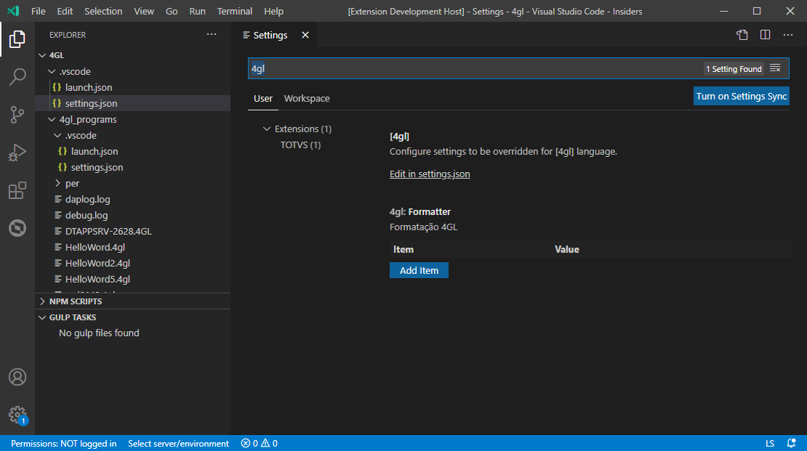

# TDS: Formatação de Código Fonte

> Requisitos
>
> - formatação ativada

## Configuração

> O motor de formatação, pode ser executado  na *extensão* ou no *LS*.
> A formatação no LS é *experimental*. Por padrão está o motor é na executado na extensão. > Para usar o novo motor, ajuste em `settings.josn` a chave:

```json
{
  totvsLanguageServer.formatter.provider=ls
}
```

Por padrão, a formatação de código fonte vem **desligado**. Para ligá-lo acesse `File | Preferences | Settings` e localize `4gl` ou `advpl`, conforme a linguagem de programação que deseja configurar.

Lhe será apresentado algo semelhante a:



> Saiba mais sobre precedência de configurações em [User and Workspace Settings](https://vscode.readthedocs.io/en/latest/getstarted/settings/).

O bloco `[4gl]` (ou `[advpl]`), são configurações ligadas a ativação dos processos pelo *VS-Code* associadas ao editor da linguagem e `[4gl.formatter]` (ou `[advpl.formatter]`), são as opções de formatação específicas.

Para sobrescrever os valores padrão, acione `Edit in settings.json`.

> Saiba mais em [Formatting](https://code.visualstudio.com/docs/editor/codebasics#_formatting) e [Indentation](https://code.visualstudio.com/docs/editor/codebasics#_indentation).

### Configurações `[4gl]` ou `[advpl]`

> A formatação para AdvPL está parcialmente implementada.

- `"files.encoding": "windows1252" | "windows1251"`

  Indica a codificação dos arquivos com código fonte. A codificação `windows1251` deve ser utilizada em fontes com *strings* no alfabeto cirílico.

- `"editor.formatOnType": true | false`

  Habilita a formatação durante a digitação.

- `"editor.formatOnPaste": true | false`

  Habilita a formatação em blocos colados.

- `"editor.formatOnSave": true | false`

  Habilita a formatação ao salvar o arquivo.

- `"editor.formatOnSaveMode": "file" | "modifications"`

  Indica o modo de formatação ao salvar o arquivo.

- `"editor.insertSpaces": auto | false | true`

  Controla se o editor irá inserir espaços para tabulações. Se definido como `auto`, o valor será determinado com base no arquivo aberto.

- `"editor.tabSize": auto | number`

  Controla o tamanho de renderização da tabulação. Se definido como `auto`, o valor será determinado com base no arquivo aberto.

- `"files.trimTrailingWhitespace": false | true`

  Habilita a remoção de caracteres não significativos ao final da linha.

### Configurações `4gl.formatter` ou `advpl.formatter`

Chaves específicas para formatação de fontes 4GL e AdvPL.

| Chave                                                  | Uso                                                               |
| ------------------------------------------------------ | ----------------------------------------------------------------- |
| maxConsecutiveBlankLines (`number`)                    | Máximo de linhas em branco em sequência. Padrão: 1                |
| maxLineLength (`number`)                               | Largura máxima de linha para quebra automática. Padrão: 120       |
| wrapParameters (`auto` \| `true` \| `false`)      | Define quebra automática de parâmetros. Padrão: auto              |
| wrapArguments (`auto` \| `true` \| `false`)       | Define quebra automática de argumentos. Padrão: auto              |
| keywordsCase <upper \| lower \| ignore>                | Coloca palavras-chaves em maiúsculas ou minúsculas. Padrão: (4GL)upper (AdvPL)ignore |
| stringStyle <double-quotes \| single-quotes \| ignore> | Usar aspas simples ou duplas em strings. Padrão: ignore           |
| operatorSpacing (`boolean`)                            | Padroniza espaços em operadores. Padrão: true                     |
| spaceAfterComma (`boolean`)                            | Garante espaço após vírgulas. Padrão: true                        |
| spaceInsideParentheses (`boolean`)                     | Controla espaços dentro de parênteses. Padrão: false              |
| alignAssignments (`boolean`)                           | Alinha sinais de atribuição em blocos. Padrão: false              |
| normalizeCalls (`boolean`)                             | Remove espaços entre chamada e `(`. Padrão: false                 |
| preserveSingleLineBlocks (`boolean`)                   | Preserva blocos de uma linha. Padrão: false                       |
| blankLinesBetweenTopLevelDeclarations (`number`)       | Linhas em branco entre declarações de topo. Padrão: 1             |
| commentReflow (`boolean`)                              | Reorganiza comentários longos. Padrão: false                      |
| trimFinalNewlines(`boolean`)                              | Remove linhas em branco no final do arquivo. Padrão: true |

### Exemplo com os valores padrão

> Arquivo `settings.json`

```JSON
{
  ...,
  "[advpl]": {
    "files.encoding": "windows1252",
    "editor.formatOnType": false,
    "editor.formatOnPaste": false,
    "editor.formatOnSave": false,
    "editor.formatOnSaveMode": "file",
    "editor.tabSize": 4,
    "editor.insertSpaces": false,
    "files.trimTrailingWhitespace": false,
  },
  "[4gl]": {
    "files.encoding": "windows1252",
    "editor.formatOnType": false,
    "editor.formatOnPaste": false,
    "editor.formatOnSave": false,
    "editor.formatOnSaveMode": "file",
    "editor.tabSize": 4,
    "editor.insertSpaces": false,
    "files.trimTrailingWhitespace": false,
  },
  "4gl.formatter": {
    "maxConsecutiveBlankLines": 1,
    "maxLineLength": 120,
    "wrapParameters": "auto",
    "wrapArguments": "auto",
    "keywordsCase": "upper",
    "stringStyle": "ignore",
    "operatorSpacing": true,
    "spaceAfterComma": true,
    "spaceInsideParentheses": false,
    "alignAssignments": false,
    "normalizeCalls": false,
    "preserveSingleLineBlocks": false,
    "blankLinesBetweenTopLevelDeclarations": 1,
    "commentReflow": false,
    "trimFinalNewlines": true
  },
  "advpl.formatter": {
    "maxConsecutiveBlankLines": 1,
    "maxLineLength": 120,
    "wrapParameters": "auto",
    "wrapArguments": "auto",
    "keywordsCase": "ignore",
    "stringStyle": "ignore",
    "operatorSpacing": true,
    "spaceAfterComma": true,
    "spaceInsideParentheses": false,
    "alignAssignments": false,
    "normalizeCalls": false,
    "preserveSingleLineBlocks": false,
    "blankLinesBetweenTopLevelDeclarations": 1,
    "commentReflow": false,
    "trimFinalNewlines": true
  }
  ...,
}
```
