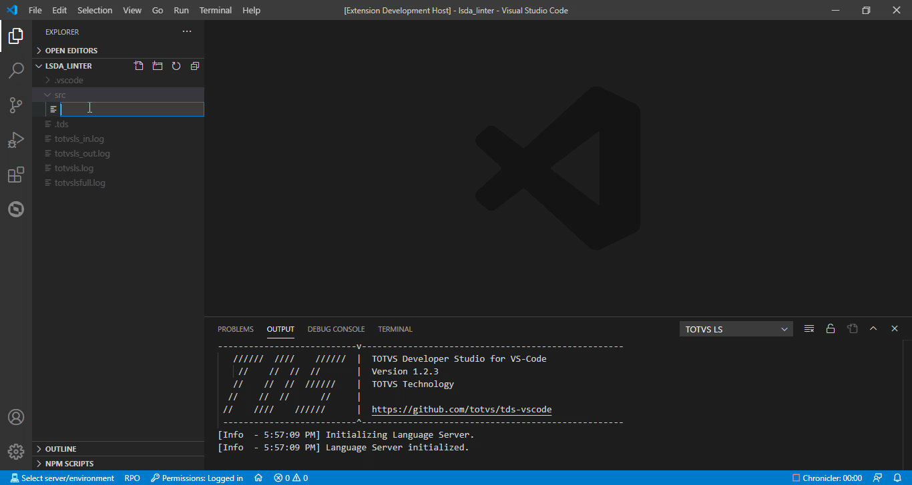

# TDS: Linter

> Requisitos
>
> - projeto aberto
> - diretório de includes configurado
> - edição de fonte

O Linter é um analisador de código estático que aponta erros de programação em seu código durante a edição. Ele apresenta os problemas encontrados no próprio Editor e também na visão de Problemas enquanto o fonte é editado pelo desenvolvedor.

Este recurso ajudará o desenvolvedor a identificar problemas antes de efetuar a compilação no AppServer. Ajudará a eliminar avisos (warnings), pois estes já serão apresentados mesmo antes de sua compilação.

## Includes

Como em qualquer compilação de um fonte AdvPL é necessário que o diretório de Includes esteja configurado corretamente para que o Linter funcione corretamente.

Caso encontre o erro "C2090  File not found PRTOPDEF.CH" é provável que o diretório de Includes não esteja configurado corretamente. Revise as configurações de Includes conforme indicado em [Configuração de Include](https://github.com/totvs/tds-vscode/blob/master/docs/compilation.md#configura%C3%A7%C3%A3o-de-include-busca-de-arquivos-de-defini%C3%A7%C3%A3o).

**Arquivos 4GL e PER (Logix):**
Para a correta análise desses arquivos o Linter necessita do arquivo .SCH (Scheme do banco de dados, normalmente logix.sch). A busca por esse(s) arquivo(s) é feita na(s) pasta(s) de include configurada(s).

## Marcações

As marcações de problemas serão apresentadas no próprio Editor e também na visão de Problemas em tempo de edição.

Se for encontrado um erro crítico no código ele será destacado com a cor vermelha no Editor e não indicará mais nenhum outro erro até que este seja sanado.

Caso contrário, se não houve erro crítico, ele apresentará avisos (warnings) se existirem.

## Compilação

Com o Linter teremos as mesmas questões que seriam detectadas somente após a compilação do fonte, então se houver uma indicação de erro e/ou warning eles serão os mesmos quando o fonte for compilado.

Se perceberem algum comportamento estranho no Linter realize a compilação do fonte. Caso o comportamento persista na compilação, favor abrir um [chamado diretamente na TOTVS](https://totvscst.zendesk.com/hc/pt-br/#home) informando o problema encontrado na compilação para que o time de AppServer possa avaliar a questão. Quando o problema for solucionado pelo time de AppServer o Linter receberá a correção nas próximas atualizações da extensão.
