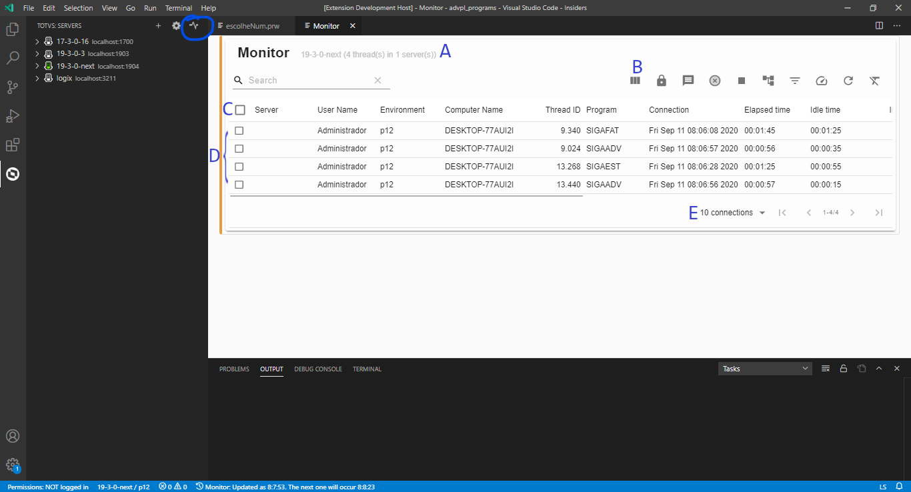
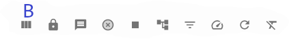
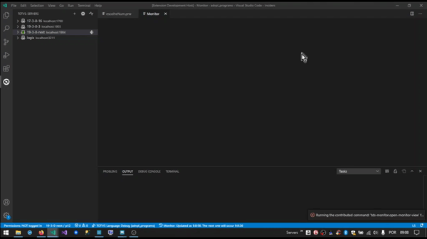
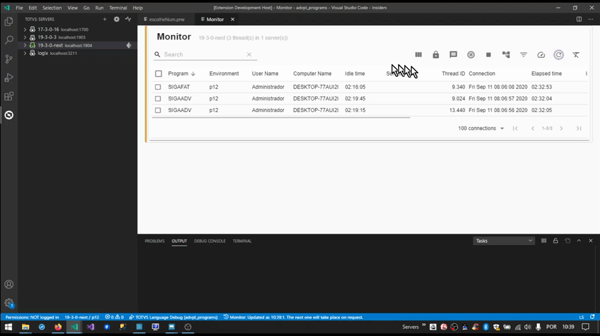

# TDS: Monitor

> Requisitos
>
> - servidor/ambiente conectado
> - usuário autenticado (se requerido)

Permite monitorar a atividade do servidor e interagir com as sessões (_threads_), enviando mensaens a usuários, encerrando sessões e outras atividades.

|     | Descrição                                                     |
| --- | ------------------------------------------------------------- |
| A   | Identificação do servidor sendo monitorado e resumo dos dados |
| B   | Botonoeira de ações                                           |
| C   | Cabeçalho                                                     |
| D   | Sessões                                                       |
| E   | Paginação                                                     |

Se acionar o _mouse_ sobre o cabeçalho de uma coluna, as sessões passam a ser ordenadas por ela. No primeiro acionamento os dados são ordenados em ordem crescente, no segundo em ordem decrescente e no terceiro a ordenação é cancelada.

A primeira coluna é para a seleção das sessões cuja ação será aplicada, podendo-se selecionar uma ou mais sessões.

Junto a identificação do servidor, você pode efetuar buscas cujo valor é aplicado em todas as colunas do tipo texto e a paginação permite navegar entre as páginas de dados e pode ser configurada o tamanho da página acionando a lista de opções (_combo_).

Ao acionar o _mouse_ sobre o cabeçalho e mantê-lo acionando, pode arrastar e soltar a coluna em uma nova posição.

## Botoneira de ações

> As ações estão descritas na ordem da botoneira.

### Apresenta/esconde colunas

### Bloqueio/desbloqueio de novas conexões

### Envio de mensagens

### Desconexão de sessões

### Parar servidor

### Agrupamento de dados

### Filtro por coluna

### Frequência de atualização

Ao configurar para `manual`, acione a ação `Refresh` quando desejar atualizar os dados.

## Redefinir

Restaura a configuração padrão do monitor.

