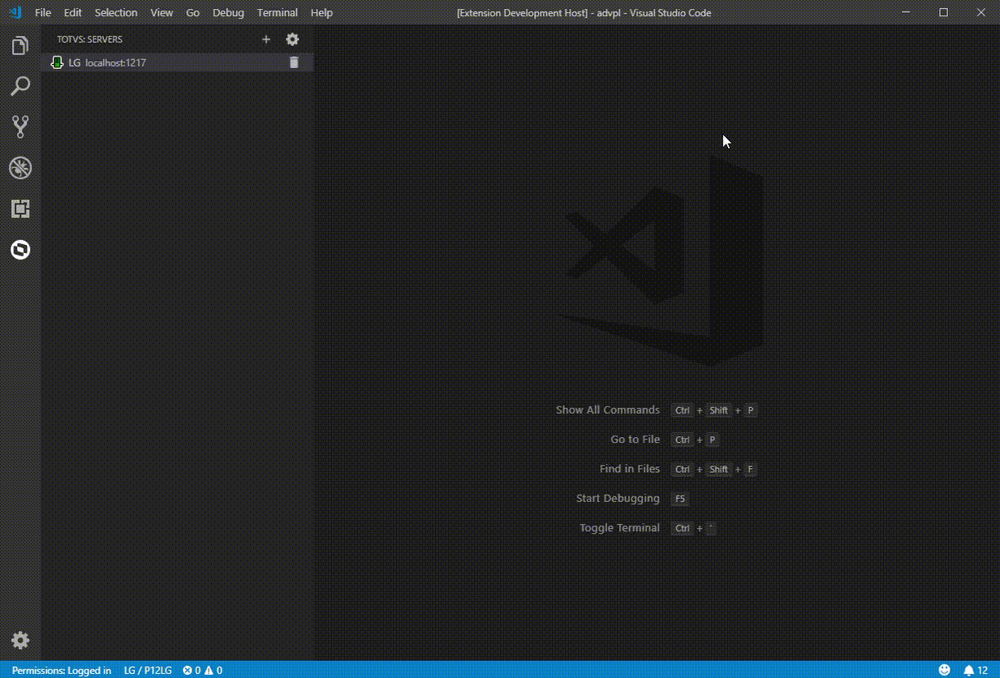

### Inspetor de Objetos do RPO

- Para visualizar os arquivos que fazem parte do RPO, conecte-se ao servidor.
- Com o menu de contexto em cima do servidor, selecione a opção `Objects inspector`.
- Abrirá um assistente com todos os arquivos que fazem parte do RPO, utilize o filtro para encontrar algum arquivo específico.
- Também é possível abrir o assistente pelo atalho `CTRL + SHIFT + P` digitando `TOTVS: Objects inspector`.

### Inspetor de Funções do RPO

- Para visualizar as funções que fazem parte do RPO, conecte-se ao servidor.
- Com o menu de contexto em cima do servidor, selecione a opção `Functions inspector`.
- Abrirá um assistente com todos as funções que fazem parte do RPO, utilize o filtro para encontrar alguma função específica.
- Também é possível abrir o assistente pelo atalho `CTRL + SHIFT + P` digitando `TOTVS: Functions inspector`.

