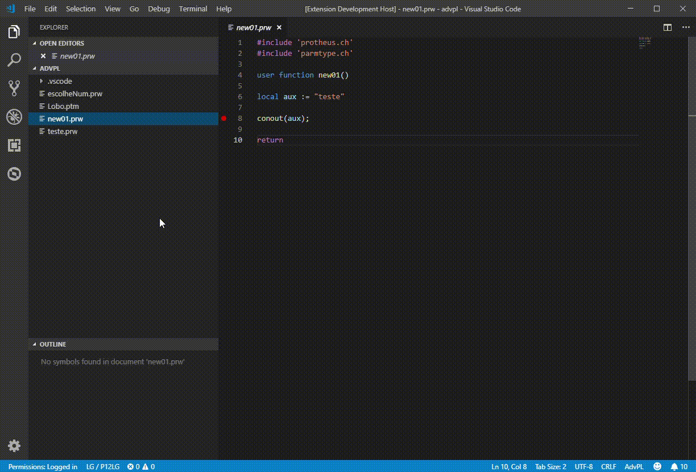
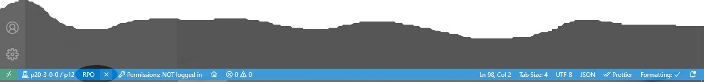
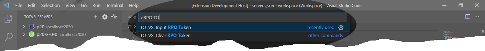

# TDS: Manutenção de RPO

> Requisitos

- servidor/ambiente conectado
- usuário autenticado (se requerido)

## Desfragmentação de RPO

Selecione o servidor, acione o menu de contexto e a opção `Defrag RPO` ou acione `CTRL + SHIFT + P` e execute `TOTVS: Defrag RPO`.
Aguarde a finalização do processo, que dependendo do tamanho do _RPO_ pode levar vários minutos.

### Deletar recursos do RPO

Selecione o arquivo ou recurso a ser removido do _RPO_servidor_, acione o menu de contexto e a opção `Delete File/Resource from RPO`. Confirme a operação e aguarde o término.

## Verificar interidade de RPO

Selecione o servidor, acione o menu de contexto e a opção `RPO Check Integrity` ou acione `CTRL + SHIFT + P` e execute `RPO Check Integrity`. Aguarde a finalização do processo e caso haja alguma ocorrência, você será notificado.

## Token de RPO

> Explicar ou direcionar para página que explique o _RPO Token_.

> Esse recurso está disponivel em servidores da versão _7.00.210324P_ e superiores.

Após selecionar o servidor, acione a ação `RPO` na barra de status e informe o token obtido.
Caso deseje remover um TOKEN de `RPO` já aplicado, acione `X` do lado direito a `RPO`.

Os comandos para informar ou remover o _RPO Token_, também podem ser executados via paleta de comandos (`ctrl+shift+p).

