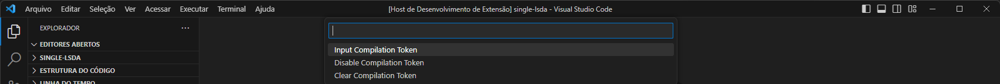
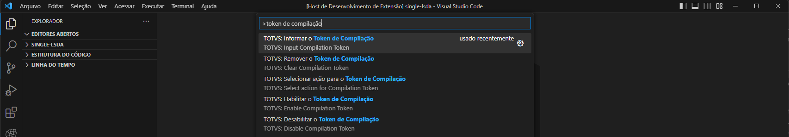

# TDS: Manutenção de RPO

> Requisitos

- servidor/ambiente conectado
- usuário autenticado (se requerido)

## Desfragmentação de RPO

Selecione o servidor, acione o menu de contexto e a opção `Defrag RPO` ou acione `CTRL + SHIFT + P` e execute `TOTVS: Defrag RPO`.
Aguarde a finalização do processo, que dependendo do tamanho do _RPO_ pode levar vários minutos.

### Deletar recursos do RPO

Selecione o arquivo ou recurso a ser removido do _RPO_servidor_, acione o menu de contexto e a opção `Delete File/Resource from RPO`. Confirme a operação e aguarde o término.

## Verificar interidade de RPO

Selecione o servidor, acione o menu de contexto e a opção `RPO Check Integrity` ou acione `CTRL + SHIFT + P` e execute `RPO Check Integrity`. Aguarde a finalização do processo e caso haja alguma ocorrência, você será notificado.

## Token de RPO

> As chaves de compilação ou _tokens_ de compilação empregados na construção do _Protheus_ e suas funcionalidades, são de uso restrito dos _desenvolvedores_ de cada módulo.
>
> Em caso de mau uso destas chaves ou tokens, por qualquer _outra parte_, que não a referida acima, a mesma irá se responsabilizar, direta ou regressivamente, única e exclusivamente, por todos os prejuízos, perdas, danos, indenizações, multas, condenações judiciais, arbitrais e administrativas e quaisquer outras despesas relacionadas ao mau uso, causados tanto à TOTVS quanto a terceiros, eximindo a TOTVS de toda e qualquer responsabilidade.
Explicar ou direcionar para página que explique o _RPO Token_.

> Esse recurso está disponivel em servidores da versão _7.00.210324P_ e superiores.

Após selecionar o servidor, acione a ação `RPO Token` na barra de status e informe o token obtido.

Caso deseje remover um TOKEN de `RPO Token` aplicado ou aplicar um novo TOKEN, acione a ação `RPO Token` na barra de status e neste caso as demais ações serão exibidas.

Além disso, podemos ao invés de remover um TOKEN, apenas desabilitá-lo temporariamente passando a não ser utilizado mais nas ações devidas. Posteriormente podemos reabilitá-lo novamente e ele voltará a ser utilizado normalmente.

Os comandos para informar ou remover o _RPO Token_, também podem ser executados via paleta de comandos (`CTRL + SHIFT + P`).

## Outras funcionalidades

### [Inspetor de Objetos](./rpo-inspector.md)
