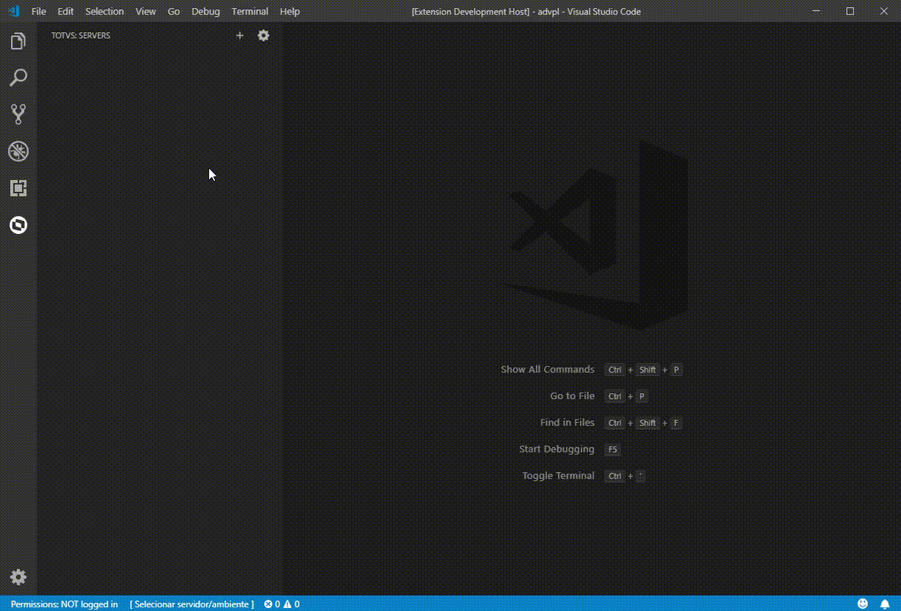
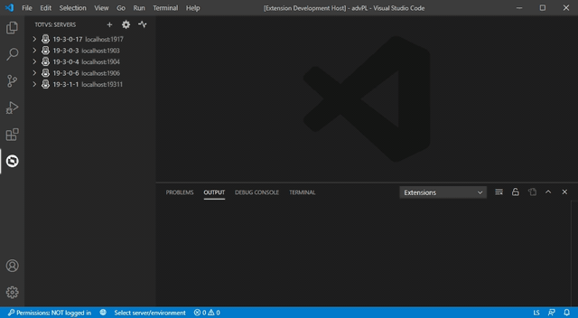
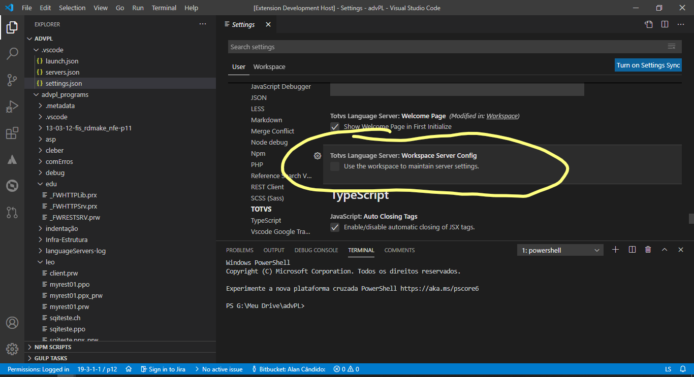
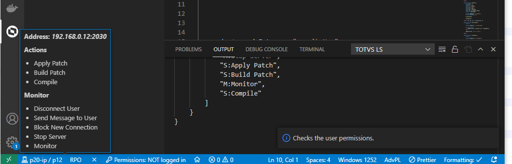

# Visão `Servers`

> Requisitos:
>
> - servidor a ser utilizado ou registrado em execução
>
>   O servidor deve ser autônomo (_standalone_), ou seja, não pode estar em um contexto de balanceamento de carga ou _broker_.
>   Nesses casos, deve-se utilizar um dos servidores identificados como secundário.
>
>   **Broker HTTP** não possui suporte a conexão via **TDS-VSCode**.

## Registro de servidores

- Clique no icone `"+"` no canto superior direito da visão, ao lado da aba `Servidores`.
- Preencha as informações de `nome`, `ip` e `porta` do servidor.
- Clique no botão `Salvar`.
- Existe o atalho que para abertura do assistente: `CTRL + SHIFT + P` digite `TOTVS: Add Server`.



## Conexão com servidores

- Após executar o cadastro de ao menos um servidor.
- Vá para visão de servidores (Acesso pelo ícone da TOTVS na lateral esquerda do VSCode).
- Clique com o botão direito e selecione a opção `Connect`.
- Informe `ambiente`, `usuário` e `senha` (pode ser "em branco") para prosseguir.
- Aguarde o termino da conexão.
- A conexão com servidores pode ser efetuada pela seleção do texto `[Selecionar servidor/ambiente]` na barra de ferramentas. Ou pelo atalho `CTRL + SHIFT + P` digite `TOTVS: Select Server`.


## Configurações das definições

As configurações com os registros dos servidores podem ser editados manualmente, desde que com cuidado e *nenhum* servidor conectado/selecionado, via editor de texto.
Pode-se acessá-lo acionando o ícone semelhante a uma engrenagem.



## Estrutura do arquivo *servers.json*

> Recomenda-se que a edição seja efetuada com *nenhum* servidor conectado/selecionado.
> Faça um cópia de segurança antes. Modificações erradas podem inviabilizar seu uso ou mesmo da extensão.

```json
{
  "version": "0.3.0",
  "includes": ["m:\\protheus\\includes"], //definição global
  "permissions": {
    "authorizationtoken": ""
  },
  "configurations": [
    {
      "id": "pgfb077eunhkt1u2mu4794eqxtfvj",
      "type": "totvs_server_protheus",
      "name": "p20",
      "port": 2030,
      "address": "localhost",
      "buildVersion": "7.00.210324P",
      "secure": true,
      "includes": [],
      "environments": ["p12"],
      "username": "admin",
      "environment": "p12",
      "token": "djM6cGdmYjA3N2..."
    }
  ],
  "savedTokens": [
    [
      "pgfb077eunhkt1u2mu4794eqxtfvj:p12",
      {
        "id": "pgfb077eunhkt1u2mu4794eqxtfvj",
        "token": "djM6cGdmYjA3..."
      }
    ],
    [
      "hgzteu0iau7kt1v9dqlbank94bu3qk:admin",
      {
        "id": "hgzteu0iau7kt1v9dqlbank94bu3qk",
        "token": "djM6aGd6..."
      }
    ],
    [
      "hgzteu0iau7kt1v9dqlbank94bu3qk:p12",
      {
        "id": "hgzteu0iau7kt1v9dqlbank94bu3qk",
        "token": "djM6aGd6d..."
      }
    ]
  ],
  "lastConnectedServer": "pgfb077eunhkt1u2mu4794eqxtfvj"
}
```

| Chave                 | Descrição/uso                                                                           |
| --------------------- | --------------------------------------------------------------------------------------- |
| `version`             | Versão do arquivo. Não editar.                                                          |
| `includes`           | Lista de pastas global para busca de arquivos de definição. |
|                       | Utilizada quando não informada na definição do servidor e para o [linter](docs/linter). |
| `permissions`        | Lista de permissões.                                                                    |
| `authorizationtoken`  | Chave de compilação com as permissões.                                                  |
| `configurations`     | Configurações de servidores registrados para uso.                                       |
| `id`                 | Identificação única, gerada no momento de seu registro.                                 |
| `type`               | Tipo do servidor, podem ser:                                                            |
|                       | - *totvs_server_protheus*, para servidores com suporte a Adv/PL. (versão )                        |
|                       | - *totvs_server_logix*, para servidores com suporte a Adv/PL e 4GL.                     |
|                       | - *totvs_server_totvstec*, para servidores com suporte a Adv/PL e 4GL, versão iqual ao superior 7.00.210324P (*Harpia*) .                     |
| `name`               | Identificação do servidor para humanos.                                                 |
| `port`               | Porta de conexão.                                                                       |
| `address`            | Endereço IP ou nome da estação do servidor.                                             |
| `buildVersion`       | Versão do servidor. Valor obtido automaticamente.                                       |
| `secure`             | Conexão segura (SSL) ou não. Valor obtido automaticamente.                              |
| `includes`           | Lista de pastas para busca de arquivos de definição.                                    |
| ``                   | Se não informada utilizará a lista padrão.                                              |
| `environments`       | Ambientes acessados.                                                                    |
| `username`           | Último usuário utilizado na conexão.                                                    |
| `environment`        | Último ambiente utilizado na conexão.                                                   |
| `token`              | Código de acesso para reconexão. Valor obtido automaticamente.                          |
| `savedTokens`        | Listas de código de acesso, associados a um servidor e ambientes.                       |
|                       | Valores obtidos automaticamente.                                                        |
|                       | \<id>:\<ambiente>                                                                       |
|                       | id: identificaão do servidor                                                            |
|                       | token: código de acesso                                                                 |
| `lastConnectedServer` | Último servidor utilizado e que será reconectado na próxima sessão de forma automática. |

## Local de gravação de *servers.json*

Por padrão, o arquivo com os registros de servidores é armazenado no arquivo `_servers.json_`, na área do usuário conforme o sistema operacional.

- **Windows** `%USERPROFILE%\\.totvsls\\settings.json`
- **MacOS** `$HOME/.totvsls/settings.json`
- **Linux** `$HOME/.totvsls/settings.json`

Caso deseje ter o registro de servidores por área de trabalho, ative a opção em `File | Preferences | Settings | Extensions | TOTVS | Workspace server config`.



Ou use a troca rápida disponível na barra de *status*.


> A troca rápida aplica-se somente a área de trabalho corrente e se sobrepoem a configuração padrão ou por usuário. Detalhes em [User and Workspace Settings](https://code.visualstudio.com/docs/getstarted/settings).

## Sistema de Privilégios

O **TDS-VSCode**, suporta um sistema simples de privilégios, baseada em configuração efetuada no arquivo *appServer.ini*, podendo-se configurar privilégios para determinadas operações e estações, através da adição de chaves na sessão `[TDS]`.

> Quando a conexão é local (*localhost*), não há restrições (sessão `[TDS]` é ignorada).

> Modificações na sessão `[TDS]` requer **reconexão** do *VS-Code*.

> Para manter o mesmo comportamento de ambientes com versões mais antigas, todas as operações vem liberadas por padrão na ausência da sessão `[TDS]` ou da chave da operação.

### Especificação da sessão

```ini
[TDS]
AllowApplyPatch=<IP/name list>
AllowBuildPatch=<IP/name list>
AllowMonitor=<IP/name list>
AllowCompile=<IP/name list>
EnableDisconnectUser=<IP/name list>
EnableSendMessage=<IP/name list>
EnableBlockNewConnection=<IP/name list>
EnableStopServer=<IP/name list>
AllowApplyTemplate=<IP/name list>

```

| Chave                    | Permissão                                 |
| ------------------------ | ----------------------------------------- |
| AllowApplyPatch          | Aplicar pacotes de atualização (*patchs*) |
| AllowBuildPatch          | Gerar pacotes de atualização (*patchs*)   |
| AllowCompile             | Compilar fontes e recursos                |
| AllowMonitor             | Acesso ao monitor de conexões             |
| EnableDisconnectUser     | Desconectar usuários                      |
| EnableSendMessage        | Enviar mensagens                          |
| EnableBlockNewConnection | Bloquear novas conexões                   |
| EnableStopServer         | Encerrar o *appServer*                    |
| AllowApplyTemplate       | Aplicar pacotes de amostras (\*.tpl)      |

- `<IP/name list>` é a lista de estações com o privilégio liberado, identificadas pelo seu endereço IP ou nome (*host name*) e separadas por `,` (vírgula).

> Para liberar o privilégio a qualquer estação, coloque `*` (valor padrão).

> Para bloquear o privilégio a qualquer estação, coloque `0` (zero).

### Exemplo

```
[TDS]
AllowApplyPatch=PRODUCAO, 10.173.7.129
AllowBuildPatch=0
AllowCompile=0
AllowMonitor=ADMIN_1, ADMIN_2, SUPER_ADMIN
EnableDisconnectUser=*
EnableSendMessage=*
EnableBlockNewConnection=SUPER_ADMIN
EnableStopServer=SUPER_ADMIN
```

Neste exemplo, temos:

- Somente a estação `PRODUCAO` ou com o IP `10.173.7.129` podem aplicar atualizações;
- Ninguém pode gerar pacotes de atualização ou compilar;
- Somente as estações `ADMIN_1`, `ADMIN_2` e `SUPER_ADMIN` podem monitorar conexões;
- Todos que tenham privilégio de acesso ao monitor, podem desconectar usuários;
- Somente a estação `SUPER_ADMIN` pode bloquear novas conexões e parar o servidor,



Passando o ponteiro do *mouse* sobre a indicação de servidor/ambiente selecionado (barra de status), lhe será apresentado os privilégios que lhe foram concedidos.
