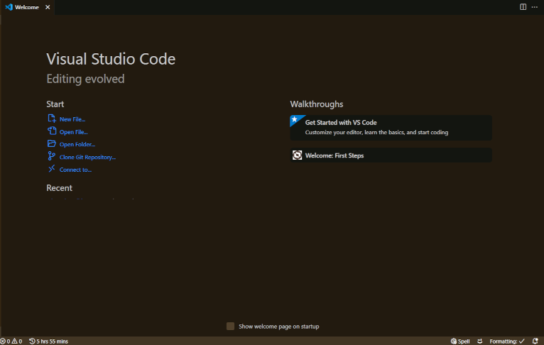
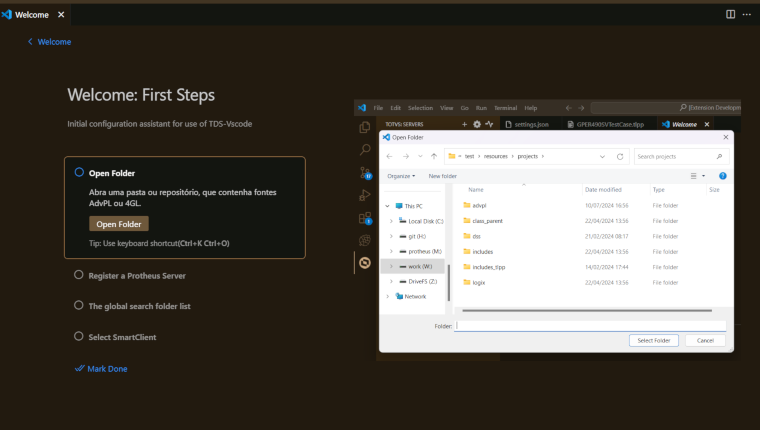

# Boas Vindas

No primeiro uso da extensão em um projeto, lhe será apresentada a página de boas vindas, que consiste de um assistente de inicialização/configuração passo a passo, com configurações mínimas necessárias para o pleno uso do **TDS-VSCode**.
Complete as tarefas para obter um ambiente mínimo.

> Também pode acessar a página acionando o comando `Welcome: Open Walkthrough...` quando necessário e selecione `Welcome: First Step`
> Para reiniciar as tarefas, acione o comando `Developer: Reset Welcome Page Walkthrough Progress`

