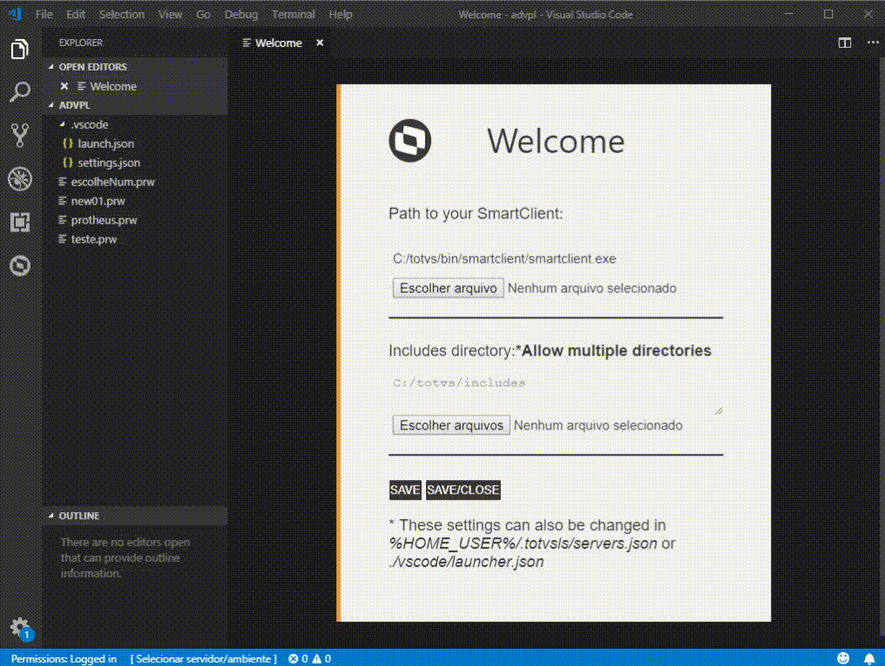
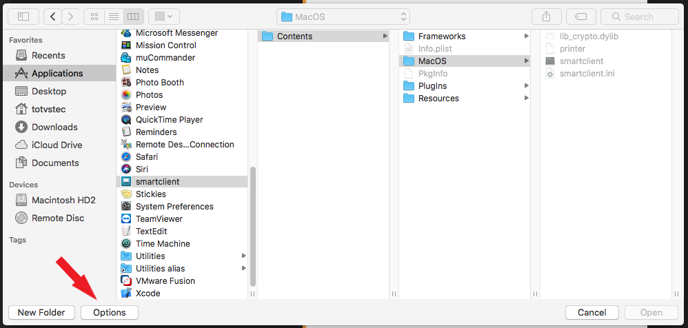
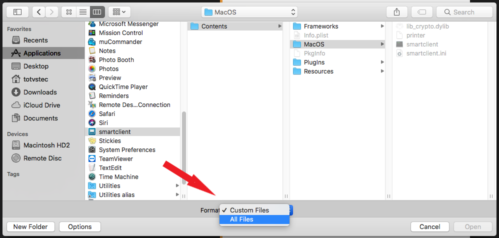
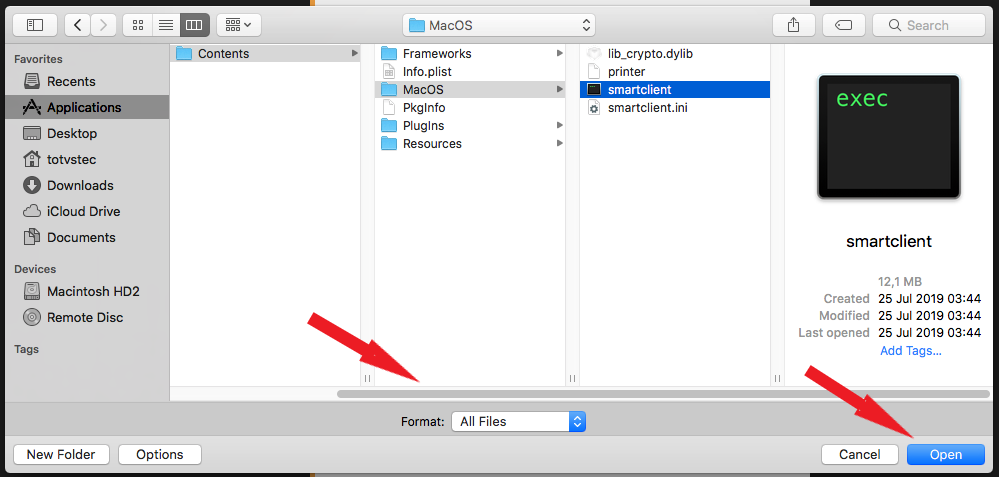

## Boas Vindas

No primeiro uso da extensão em um projeto, lhe será apresentada as [Boas Vindas](docs/welcome.md) com configurações mínimas necessárias para a localização do _SmartClient_ e dos diretórios de buscas de arquivos de definição (_includes_) que serão utilizados durante a compilação dos códigos fontes.

- Localize o `smartClient.exe` (Windows) ou `smartclient` (Linux/Mac)
>  O binário no MacOS encontra-se em `smartclient.app/Contents/MacOS/smartclient`.
- Localize as pastas de buscas de arquivos de definição (_includes_) que necessitar para seus projetos.
> Em Linux/Mac Na janela é necessário mudar o filtro de `Custom Files` para `All Files`.
- Acione `Salvar` para concluir.

