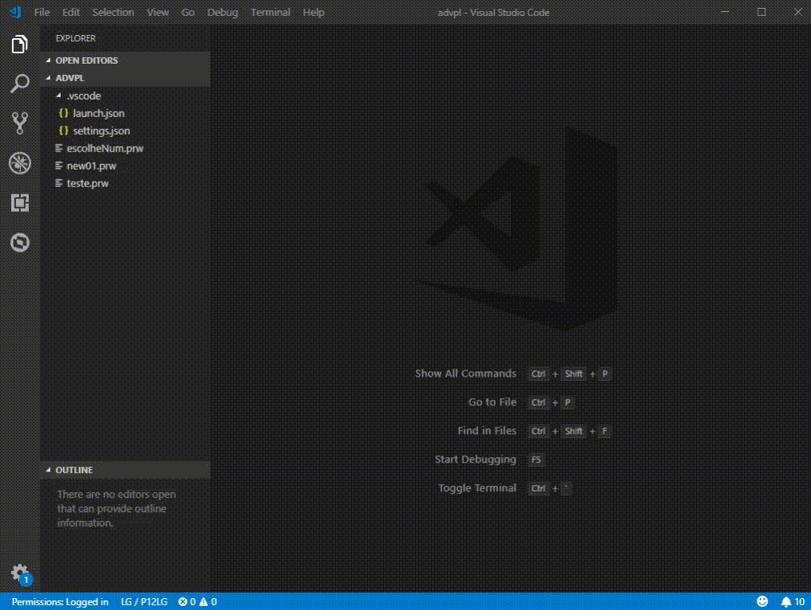

# TDS: Geração de cliente de serviço web (_WEB Service_)

> Requisitos

- servidor/ambiente conectado
- usuário autenticado (se requerido)

## Geração do cliente

Gera o cliente de serviço web acionando `CTRL + SHIFT + P` e executando `TOTVS: Generate WS Protheus`. Informe a URL que contem a definição _WSDL_, pasta de destino e nome do arquivo-fonte a ser gerado e aguarde a geração.

