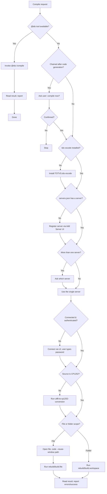

# AdvPL/TLPP Compile (tds-vscode)

## Overview

Compile AdvPL and TLPP source files from inside VS Code using the **TOTVS Developer Studio for VSCode** extension (`TOTVS.tds-vscode`). Compilation in the Protheus ecosystem requires a connected and authenticated AppServer: the extension reads its connection registry from `servers.json`, sends the source to the server's RPO (Repository of Programs/Objects), and returns the compilation result.

This skill orchestrates the complete path so a single "compile" request works end-to-end even on a fresh machine:

1. Ensure the extension is installed (install it if missing).
2. Ensure a server is configured in `servers.json` (configure it with the user if missing).
3. Pick the target server (ask the user when more than one exists).
4. Connect and authenticate (the **user** types the password — it is never exposed to the agent).
5. Open the target source in the editor (required before a file-scope compile).
6. Run the build/rebuild command for the file, folder, or workspace.
7. Report the result and surface any compilation errors.

## When to Use

Use this skill when:

- The user asks to **compile** or **recompile** an AdvPL/TLPP source (`compile`, `recompile`, `build`, `compilar`, `enviar para o RPO`).
- A code-generation, migration, or refactoring skill just produced/changed `.prw`, `.prg`, `.prx`, `.tlpp`, `.ppx`, `.ppp`, `.apw`, `.aph`, `.apl`, or `.ahu` files that must be sent to the AppServer.
- The user wants to validate that a source compiles cleanly against a server.
- The tds-vscode extension is not yet installed or configured and the user wants to start compiling.

**Do NOT use when:**

- The user only wants static analysis / linting without sending to the RPO.
- The target language is not AdvPL/TLPP/4GL.
- The user explicitly wants a command-line (`tds-cli` / `advpls`) build outside VS Code.

---

## CRITICAL — Agent Execution Rules

> **These rules are MANDATORY.**

1. **NEVER ask for, read, store, echo, or write the AppServer password.** Authentication is interactive: the user types the password directly in the VS Code connection prompt. If a step needs the password, instruct the user to type it in the prompt and wait — do not collect it with any tool.
2. **ALWAYS use the extension UI to register and connect servers.** Never edit `servers.json` by hand. Server registration goes through the *Add Server* assistant and connection goes through the connection prompt, so the extension validates the data and fills generated fields (`id`, `buildVersion`, `secure`, `token`) itself.
3. **NEVER write `token`, `savedTokens`, or `authorizationtoken` values into `servers.json`.** Those are generated by the extension after a successful connection. The agent does not write to `servers.json` at all — it only reads it to detect existing servers.
4. **Ensure the source is CP1252 before compiling.** The Protheus compiler only accepts Windows-1252 files. If the file was created/edited by an AI agent (UTF-8), run the `utf8-to-cp1252-conversion` skill first, otherwise compilation fails with garbled characters.
5. **Always confirm the target server with the user when more than one is registered.** Never guess.
6. **When this skill runs as a follow-up to code generation/migration/refactoring, ASK the user whether they want to compile before starting.** Do not auto-compile silently after another skill produced code.
7. **Read the result before declaring success.** A command running without error is NOT proof of a successful compile — check the compilation output/Problems for errors and warnings.

---

## Bundled Reference File

This skill uses progressive disclosure. Read the reference on demand:

| Reference File | When to Read | Content |
| --- | --- | --- |
| [references/tds-vscode-reference.md](references/tds-vscode-reference.md) | Whenever you need an exact command ID, the `servers.json` schema/location per OS, the list of compilable extensions, or troubleshooting guidance | Full command-ID table, `servers.json` schema and example, OS-specific file paths, supported extensions, common compile errors and fixes |

---

## Procedure

### Path A — `@tds /compile` (Preferencial)

A extensão tds-vscode expõe um participante de chat VS Code `@tds` com o comando de barra `/compile`. **Sempre tente este caminho primeiro** — é mais simples, diretamente integrado à extensão e não requer gerenciamento manual de conexão com o servidor.

1. Verifique se a ferramenta do participante de chat `@tds` está disponível no conjunto de ferramentas atual.
2. Se disponível → invoque `@tds /compile` passando o caminho absoluto do arquivo-fonte de destino como argumento.
3. Leia o resultado da compilação retornado pelo participante e reporte ao usuário (consulte o Step 9 do Path B para orientações sobre o relatório).
4. **Se `@tds` não estiver disponível** (participante não encontrado, ferramenta não listada, slash command não reconhecido ou qualquer erro de invocação) → prossiga para o **Path B** abaixo.

---

### Path B — Comandos da Extensão (Fallback)

Use este caminho somente quando a ferramenta `@tds /compile` **não estiver disponível**.

Siga estas etapas em ordem. Pule uma etapa somente quando sua pré-condição já estiver satisfeita.

### Step 0 — Confirm intent when chained after code generation

If this skill is being triggered automatically right after another skill produced or changed code (e.g. `mvc-generator`, `smartx-generator`, `advpl-to-tlpp-migration`, `refactor`), **ask the user first** whether they want to compile the generated source now. Only proceed when the user confirms. When the user invoked compilation directly, skip this step.

### Step 1 — Verify the extension is installed

Check whether `TOTVS.tds-vscode` is installed.

- If **installed**: continue to Step 2.
- If **missing**: install it (extension id `TOTVS.tds-vscode`, name "TOTVS Developer Studio for VSCode"). After install, tell the user a window reload may be required for the TOTVS activity-bar view to appear, then continue.

### Step 2 — Verify the server configuration (`servers.json`)

Locate `servers.json` (see [reference](references/tds-vscode-reference.md) for the per-OS path; default is `~/.totvsls/servers.json`, or a workspace-local copy when *Workspace server config* is enabled).

- **File missing or `configurations` array empty** → go to Step 3 (configure a new server).
- **One or more servers present** → go to Step 4 (select a server).

### Step 3 — Configure a server through the UI (only when none exists)

The extension stores connections per machine, so a configuration may legitimately not exist yet. **Always register the server through the extension UI — never edit `servers.json` by hand.**

1. Open the *Add Server* assistant: trigger `totvs-developer-studio.add` (or click `+` in the **TOTVS → Servers** view).
2. Ask the user to fill the assistant fields and save. Tell them exactly what each field expects:

| Field | What to enter | Notes |
| --- | --- | --- |
| `name` | Friendly name for the server | e.g. `local`, `p12-dev` |
| `address` | IP/hostname of the AppServer | e.g. `localhost` |
| `port` | TCP port (the *TDS/LSP* port, not the SmartClient port) | e.g. `2030` |

3. After saving, configure the *Include* folders (`.ch`/`.th` definition files) via the *Include* assistant (`totvs-developer-studio.include`) — recommended for sources that use includes.

> **Do NOT ask for the password here.** The password is requested only at connection time (Step 4). The extension fills `id`, `buildVersion`, `secure`, and `token` automatically on first connect — the agent does not write any of these.

### Step 4 — Select the target server

- **Exactly one server** registered → use it.
- **More than one** → ask the user which server to compile against (list them by `name`/`address:port`). Never assume the default or last-connected one without confirming.

### Step 5 — Connect and authenticate

Compilation requires the chosen server to be **connected and authenticated** with exclusive RPO access.

- If the server is already connected, continue to Step 6.
- Otherwise, start the connection: trigger `totvs-developer-studio.connect` (or `totvs-developer-studio.serverSelection`) for the chosen server.
- The extension will prompt for **environment**, **username**, and **password**. Instruct the user to enter these in the VS Code prompt. **The agent must not collect or transmit the password.**
- Wait for the connection to complete before continuing.

> If compilation later fails with *"It wasn't possible to obtain exclusive access to the objects repository"*, other users/JOBS are holding the RPO. See troubleshooting in the [reference](references/tds-vscode-reference.md).

### Step 6 — Ensure CP1252 encoding

Before sending to the RPO, confirm the target source(s) are Windows-1252 encoded. If any file was generated/edited in UTF-8, run the `utf8-to-cp1252-conversion` skill first. Skip only if the files are already CP1252.

### Step 7 — Open the source file in the editor

> **CRITICAL — always open the file before compiling it.** The file-scope commands `totvs-developer-studio.rebuild.file` / `build.file` have **no file-path argument**; they act on the **active text editor** (bound to `Ctrl+F9`/`Ctrl+Shift+F9` with `when: editorTextFocus`). If the target source is not open and focused, the command compiles the wrong file or nothing.

Open and focus each target source **before** running any file-scope compile.

**Preferred method — open via terminal (`code` CLI).** This is the most reliable way to open and focus a file for automation; the editor command (`vscode.open`) frequently fails in agent contexts:

- run in terminal: `code --reuse-window "/absolute/path/to/source.tlpp"`
- `--reuse-window` opens the file in the current VS Code window (does not spawn a new one)
- the file becomes the active editor, satisfying the `editorTextFocus` requirement of the file-scope compile commands

**Fallback method — `vscode.open` editor command.** Only if the terminal `code` CLI is unavailable. Note this often returns *"Failed to run command"* in agent contexts even with a valid URI and `skipCheck`:

- command id: `vscode.open`
- args: `["file:///absolute/path/to/source.tlpp"]` — a **`file:///` URI**, not a plain path
- `skipCheck: true` — required, because `vscode.open` is not in the validated palette list; without it the tool returns *"Failed to find command"*

If you need to compile several individual files, open each one (they become "open editors") and use the *open editors* command in Step 8.

> Why this matters: calling `rebuild.file` without opening the source means there is no matching active editor. Prefer the `code --reuse-window` terminal command — it reliably opens and focuses the file. The `vscode.open` editor command may fail in agent contexts (returns *"Failed to run command"* / *"Failed to find command"*), so treat it only as a fallback.

**Exception — folder/workspace compile:** when compiling a whole folder or the workspace, you do **not** need to open files. Skip this step and use the workspace/folder command in Step 8.

### Step 8 — Run the compilation

Choose the command that matches the scope (full IDs and shortcuts in the [reference](references/tds-vscode-reference.md)):

| Scope | Recompile (build everything) | Compile (incremental) | Shortcut | Needs file open/focused? |
| --- | --- | --- | --- | --- |
| Current/active file | `totvs-developer-studio.rebuild.file` | `totvs-developer-studio.build.file` | `Ctrl+F9` / `Ctrl+Shift+F9` | **Yes — open it in Step 7 first** |
| All open editors | `totvs-developer-studio.rebuild.openEditors` | `totvs-developer-studio.build.openEditors` | `Ctrl+F10` / `Ctrl+Shift+F10` | Open the target editors in Step 7 first |
| Folder / workspace | `totvs-developer-studio.rebuild.workspace` | `totvs-developer-studio.build.workspace` | — | No |

- For a single source: **open it (Step 7) → then** run the *file* command (no args — it targets the focused editor).
- For a folder or many files: use the *workspace* command — most reliable for automation, no open editor needed.
- Use **rebuild** (recompile) when in doubt — it always recompiles the source in focus.

### Step 9 — Report the result

After the command finishes:

- Inspect the TDS console / **Problems** view for errors and warnings.
- If multiple files were compiled, the *compile result* table (`totvs-developer-studio.show.result.build`) summarizes per-file status.
- Report clearly: which server/environment was used, what compiled successfully, and any failures with their messages.
- If errors are encoding-related (mojibake, invalid characters), re-run Step 6 and recompile.

---

## Decision Flow

## Anti-patterns

- **Asking for the password.** Never. The user types it in the VS Code prompt.
- **Editing `servers.json` by hand.** Always register/connect through the extension UI; manual edits can corrupt the registry and skip validation.
- **Writing tokens into servers.json.** Tokens are extension-generated; manual values corrupt the registry.
- **Auto-compiling after code generation without asking.** When chained, always confirm with the user first.
- **Calling `rebuild.file`/`build.file` without opening the file first.** They act on the active editor only — open the source with `code --reuse-window "/path/to/source"` in the terminal first (preferred), or use the workspace/folder command.
- **Relying on `vscode.open` to open the file.** It often returns *"Failed to run command"* in agent contexts. Prefer `code --reuse-window` in the terminal; use `vscode.open` (URI + `skipCheck: true`) only as a fallback.
- **Compiling without a connected server.** The build commands silently fail or error without an authenticated connection.
- **Declaring success without reading the result.** Always verify the console/Problems output.
- **Compiling UTF-8 files.** Convert to CP1252 first.
- **Guessing the server when several exist.** Always confirm with the user.
